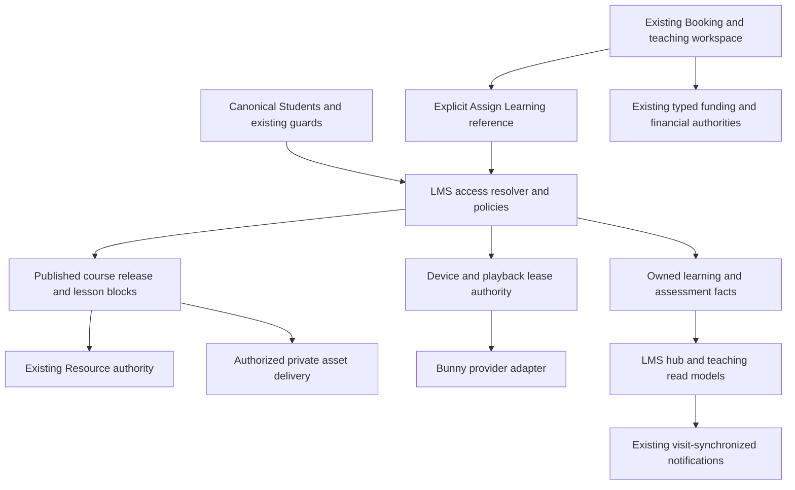

# LMS V1 Implementation Plan

Date: 2026-10-07 (Africa/Cairo). Stage 1 discovery is retained below. The owner separately authorized Stages 2 and 3; sections 12 and 13 record their actual contracts and supersede the corresponding proposals. Production has not been deployed in this task.

## 1. Baseline, authorities and evidence precedence

Accepted **APPLICATION RELEASE SHA**: `4296b21368cbc9c564d0cb7a85e29b2ae408e0ee`, also identified by local tag `pre-lms-stable`. Discovery checkout: `C:/Users/e/Herd/ArabicwAbdallah`, branch `main`, documentation HEAD `91f795bbf6cedc750b6b14340612b83ec369c1d0`. The intervening commits `6f1d60d` and `91f795b` change Markdown only. A complete baseline-to-HEAD path comparison found no application, migration, dependency, asset or configuration difference. Later documentation hashes must never be presented as a new application release or deployed just to align hashes.

Mandatory authorities reviewed:

| Authority | Use in this plan |
|---|---|
| [PRE_LMS_INVARIANTS.md](PRE_LMS_INVARIANTS.md) | All 27 contracts, mapped in section 4; no exception requested |
| [APPLICATION_CAPABILITY_MATRIX.md](APPLICATION_CAPABILITY_MATRIX.md) | Stable inventory, all 153 capability meanings/business rules, integration-relevant ownership/routes/source and tests |
| [PRODUCTION_APPLICATION_ACCEPTANCE_REPORT.md](PRODUCTION_APPLICATION_ACCEPTANCE_REPORT.md) | Latest release evidence, final dispositions and named constrained branches |
| [PRE_LMS_DEFECT_AND_REMEDIATION_LOG.md](PRE_LMS_DEFECT_AND_REMEDIATION_LOG.md) | All nine repaired failures and regression requirements |
| [MISSING_FEATURES_BACKLOG.md](MISSING_FEATURES_BACKLOG.md) | Context only; all four candidates remain unauthorized |
| [REMAINING_FEATURES_IMPLEMENTATION_TRACKER.md](REMAINING_FEATURES_IMPLEMENTATION_TRACKER.md) | Current acceptance addendum and prior five-stage integration/lifecycle history |

Additional relevant material: `AGENTS.md`; repository Laravel architecture/security/migration and testing-isolation skills; `README.md`; `SYSTEM_REFERENCE.md` architecture/schema/security/testing sections; `PROJECT_STATUS.md` baseline context; `PASS_3_LESSON_WORKSPACE_REPORT.md`; `PASS_4_TYPED_ENTITLEMENTS_REPORT.md` and typed-provenance migrations/services; `STAGE_2_STUDENT_TEACHING_EXPERIENCE_REPORT.md`; staff/lifecycle/development-tools entries of the tracker; `STAGE_5_DEVELOPMENT_LAUNCH_DATA_TOOLS_REPORT.md`; `PRE_LMS_PRODUCTION_DEPLOYMENT_REPORT.md`; `PRE_LMS_PRODUCTION_QA_CLEANUP_CHECKLIST.md`. Active controllers, policies, services, migrations, guards, routes, components and relevant tests were cross-checked against these records.

Precedence: the latest acceptance/invariants and executable current authority supersede historical release/status descriptions. For example, the matrix's original 7cb9a23 production SHA and empty dataset describe its earlier inventory; its acceptance addendum and final report establish 4296b21 and the retained acceptance cohort. Earlier 257 PHPStan findings are superseded by the accepted 255. These are historical checkpoints, not material contradictions. The current user instruction authorizes discovery now; old owner-review/cleanup sequences do not authorize cleanup or prevent documentation discovery.

Production evidence is **recorded acceptance evidence**, not a new live production inspection. Accepted evidence: 153 capabilities (26 Public, 28 Student, 99 Super Admin), 105 PASS / 48 PARTIAL / 0 FAIL / 0 NOT TESTABLE; nine defects repaired (0 Critical, 1 High, 8 Medium, 0 Low); 1,044 PHP tests / 9,004 assertions, 26 MariaDB concurrency tests / 152 assertions, 20 JS tests, build/cache/format/whitespace/audits, PHPStan 257 → 255 with no added finding. See status document for fresh local results.

Local installed stack inspected: PHP 8.4.25, Laravel 13.32.0, Livewire 4.4.5, PHPUnit 12.5.35, Pint 1.32.1, Larastan 3.12.2, Vite 8.3.0; Blade/Alpine/Tailwind. Local runtime is MariaDB 10.11.18, InnoDB, `bolt_landing` at localhost:3307; test configuration explicitly uses separate `bolt_landing_test`. All 74 pre-foundation local migrations were Ran (Stage 2 metadata corrects the initial count of 75; the single new migration brings the actual current count to 75). Schema discovery counted **107 tables in the local application schema**, **10 generated columns** and **4 typed guards**, with zero existing lms_* tables; Artisan's overall 769-table display spans multiple local schemas and is not an application table count. Accepted production reports **110 tables / MariaDB 11.8.9**. No local/production table-count equality or fresh production-schema certification is claimed; Stage 2 must inventory production-only/legacy tables before additive DDL. Relevant live local tables confirm unsigned bigint IDs, restrictive material/teaching FKs and the expected indexes.

## 2. Architecture strategy and capability ownership

Retain the modular monolith: one application/database, existing `app/Domains/*`, controllers under `app/Http/Controllers`, explicit policies in `AppServiceProvider`, existing Blade/Alpine/Livewire and shared components. Thin root `app/Models` and `app/Services` compatibility classes are not competing domain authorities; use the active `App/Domains` implementations.

Propose one bounded `App/Domains/Lms` domain for curriculum, access decisions, learning state and media playback. Names are proposals, not classes created in Stage 1. Its services should include authoring/publication, access resolution, enrollment, learning progress, assessment, assignment/review, playback leases and learning read models. Avoid a second identity system, Resource library, financial ledger, generic notification inbox, settings system or audit store.

Reserve **LMS-*** for later permanent capabilities, with audience and owner metadata: curriculum/authoring and access (staff), hub/player/progress (Student), discovery/public content (Public), teaching integration (teaching staff), analytics/security/settings (appropriately privileged staff). The LMS domain maintains this namespace, reviewed alongside the authoritative matrix. Do not assign numbered final IDs here. `PUB-001–026`, `STU-001–028`, `SA-001–099` remain stable; add cross-references later without redefining their meanings.

Existing `/student/learning` and `student.teaching.index` serve tutoring teaching records (STU-013–018). Proposed LMS routes use `/student/lms` with distinct `student.lms.*` names; Course Studio `/admin/lms`; public discovery `/courses`, subject to Stage 2 route checks. Existing booking `student.lessons.*` continues to mean a Booking workspace. UI may link the areas together without renaming or repurposing current capabilities.

The arrows below represent authorized reads/references or the named domain's own writes, not conversion between tutoring and LMS facts.

## 3. Integration discovery and classification

Path shorthand in this section: **S** = `app/Domains/Students`; **B** = `app/Domains/Booking`; **R** = `app/Domains/Resources`; **A** = `app/Domains/Administration`; **C** = `app/Domains/CMS`. Service/model names refer to their `Services/*.php` / `Models/*.php` files in that domain. **I#** denotes the numbered PRE_LMS_INVARIANT. Every lifecycle below also obeys section 7's archive, merge and privacy rules. NEW means **NEW BOUNDED LMS DOMAIN**; SEPARATE means **SEPARATE BY DESIGN**.

| Area / decision | Existing authority and code/tables | Authorization and ownership | Lifecycle / LMS relationship | Risk, invariants, stages |
|---|---|---|---|---|
| Student identity — REUSE | S/Student, StudentIdentityService, StudentEmailService; `students`, `student_emails`, auth attempts; Student/AuthController | Verified, nonsuspended, unmerged canonical Student; normalized DOB/name/email/phone; Resource lead email is never proof | Reference `students.id`; extend canonical merge/privacy only for new dependents; no LMS accounts or signup | High: mistaken login/import/merge. I1–2,17,24,27; 2,4,7,8,9 |
| Student authentication/session — REUSE | `config/auth.php`, `EnsureStudentAuthenticated.php`, Student/AuthController; `sessions` | Student guard plus matching session ID and absolute 180-minute proof; web staff guard is separate | Every private player/read/write/refresh rechecks current proof; authorized device never replaces login or extends expiry | High: session resurrection/cross-guard impersonation. I2–3,5; 2,4,5,8,9 |
| Staff authorization — EXTEND | A/Administrator, EnsureAdminRole/EnsureAccountActive/EnsureAdministratorSecondFactor; StudentTeachingPolicy, workspace/material/bin policies; `administrators.role` | Super/Admin teaching management; Assistant retains accepted operational/Educational Note rights, no inferred teaching/CMS/finance/security right | Add explicit LMS policies/actions and role-filtered links; retain inactivity/MFA/security flows | High: role or navigation expansion. I3–5,24; 2–9 |
| Resources — EXTEND | R/Resource; public/admin ResourceController; B/LessonMaterialService::openResource; `resources`, translations, requests/downloads; Media reference checks | Public gate differs from authenticated learning reference; private LMS access plus current Resource publication; Resource root remains authoritative | Reference ID, never copy bytes/lead gate; bounded new LMS reference checks in replacement/deletion/reset; withdrawn source denies immediately | High: gate consumption, stale source, accidental deletion. I19–20,23–24,27; 2,3,4,7,8,9 |
| Private files — EXTEND | `config/filesystems.php` local private root; LessonMaterialService privatePath/open/cleanup; PassiveLessonPdf, SafeLessonUrl; System/DevelopmentDataFiles/BackupService | Check parent, owner, share/status and path before delivery; public Media is explicitly public | Reuse validation/storage/delivery primitives via a bounded extraction when needed; new assets retain their own course/submission ownership, not a global file entitlement | High: public paths, symlinks, cache, cleanup. I2,19–20,24,27; 2,3,4,6,7,9 |
| Teaching records — REUSE / EXTEND | S/TeachingRecordService and StudentTeachingReadModel; current nine teaching tables | Student-scoped and explicitly shared; preparation structurally staff-only; Assistant denied teaching | Existing records remain authoritative; add LMS references and a read-only timeline projection, never bulk-convert records to curriculum | High: private text propagation. I2,17,20–24; 7,8,9 |
| Lesson Workspace — EXTEND | Student/Admin LessonWorkspaceController, LessonWorkspacePolicy/LessonMaterialPolicy; `bookings`, `lesson_materials` | Own completed or ended-confirmed Booking plus shared, nonwithdrawn material; course membership alone insufficient | Add Assign Learning and follow-up links; retain Booking eligibility and history; LMS Lesson is a different entity | High: future/foreign workspace leakage or delivered-lesson inflation. I2,6,10,20–21,25; 7,8,9 |
| Homework — EXTEND | S/Homework, TeachingRecordService; Student/HomeworkController; `homeworks` | Student changes only shared own in_progress/submitted response; tutor decides completed; completed writes 409 | Keep one tutoring homework row; optional bridge to LMS lesson/activity, no duplicate response/status writer; reusable course assignments are separately versioned | High: Student claiming completion or two review authorities. I2,20–21,24; 6,7,9 |
| Learning plans — REUSE / EXTEND | S/LearningPlan, TeachingRecordService; `learning_plans` | Staff authors, Student reads shared own plans | Optional selected LMS targets complement goals; no conversion into course enrollment or course tree | Medium: plan visibility/status conflation. I2,21,24; 7,8,9 |
| Milestones — REUSE / EXTEND | S/LearningMilestone; plan-locked saves; `learning_milestones` | Owner through plan; tutor controls completion/time | Optional learning evidence link; automatic evidence does not automatically mark existing tutoring milestone completed | High: tutor authority lost. I2,17,21; 6,7,8,9 |
| Student error/pronunciation log — REUSE | S/StudentErrorLog, TeachingRecordService/read model; `student_error_logs` | Shared owner-scoped category/status; staff writes | Link practice targets if selected by tutor; preserve practising/improved/resolved and privacy redaction, no speech/AI scoring | Medium: inferred proficiency/private correction exposure. I2,21,23–24; 7,8,9 |
| Teaching tags — REUSE | S/TeachingTag; Student-lock normalization/dedup; `teaching_tags` | Private teaching context, explicit sharing; not public catalog taxonomy | Preserve label/history across merge; do not add destructive uniqueness over existing rows; optional practice linkage | Medium: merged history loss/public tag leakage. I1–2,21; 7,8,9 |
| Student Educational Notes — REUSE | S/StudentBin; StudentBinController/StudentBinPolicy; `student_bins` | Assistant/Admin may read/create; creator-aware editing; Super deletion; Student edits authored visible notes | Keep current moderation/deletion; course notes/bookmarks have private Student ownership and distinct playback context, not automatic shared notes | High: incompatible edit/delete/sharing rights. I2,4,21,24; 4,7,8,9 |
| Tutor preparation — SEPARATE | S/TutorPreparation, TeachingRecordService; `tutor_preparations` | Active Admin/Super teaching only; no student_visible switch | Remains tutor-only; never appears in course export, assignments, notifications, Student preview or progress | High: structural privacy regression. I2,4,20–24; 7,8,9 |
| Lesson materials — REUSE / EXTEND | B/LessonMaterialService/Model, workspace controllers, StoreLessonMaterialRequest; `lesson_materials` payload CHECK | Booking owner plus workspace/share/withdrawal rules, even when navigated from LMS | Keep private PDFs, Resource references and safe recording/link types; private learning can link to workspace, never promote files into catalog | High: weakened historical ownership. I2,19–21,24,27; 3,4,7,9 |
| Post-lesson feedback — SEPARATE | S/LessonFeedback; Student/LessonFeedbackController; `lesson_feedback` booking-unique | Owned completed Booking; locked upsert; private staff reading | Retain rating/comment for tutoring only; no public course testimonial or course completion fact | Medium: false lesson status/public comment. I2,10,21,24; 7,8,9 |
| Student progress summary — EXTEND | StudentTeachingReadModel, `components/student-progress.blade.php`; stored Bookings/homeworks/milestones/error facts | Existing owner/share filter; new LMS pane uses separately authorized learning facts | Show separate tutoring and LMS totals and their denominators; no combined hours/credits/mastery number | High: finance/attendance semantic drift. I2,12–18,21,23; 4,6,7,8,9 |
| Student next-action logic — EXTEND | StudentPortalService + StudentTeachingReadModel::data; FormAssignmentService; EntitlementService | Server-owned priority/eligibility; current questionnaires → homework → Resource → compatible booking → progress | Preserve existing priorities; initially add explicit LMS Continue/For You cards. Any new global priority interleave must be a tested bounded decision; no generic-credit booking inference | High: regression in forms/booking/typed eligibility. I2,9,12–13,21–22; 4,7,8,9 |
| Notifications — EXTEND | S/StudentNotificationService::synchronize; NotificationController/views; `student_notifications` global hashed dedupe key and read_at | Current authenticated owner; generic messages and fresh destination authorization | Add LMS fact producers to visit synchronization; namespaced semantic keys include Student and version, preserve read state; no worker/channel switch | High: stale links, duplicate messages/private text. I2–3,21–24; 4,6,7,8,9 |
| Analytics — EXTEND with NEW learning facts | AnalyticsService/AnalyticsController, TrackVisitorSession, ReportPeriod/ExportService; events/visitors/sessions/daily rollups | Bounded metadata, staff/preview/bot exclusion; teaching reports Admin/Super only, no private answers in exports | Learning states/events own progress; public analytics retains acquisition/cutover. Distinct semantic recorder per action; permission-filtered descriptive LMS read models | High: double events, privacy and historical denominator changes. I7,12–18,21,23–24; 4,5,6,7,8,9 |
| Audit — EXTEND | AuditLogService::log/logStudent, AuditLogPresentation; `audit_logs` | Safe actor/entity/status changes; viewer Super-only; no tokens/answer/preparation bodies | Use existing audit for privileged publishing/access/review/device/preview changes; bounded LMS lifecycle events serve learning history, not a replacement audit | High: copied secrets/lost actor. I5,17,21,23–24,27; 2–9 |
| Settings — EXTEND | C/Setting, Admin/SettingController, config/business/services and OperationalSettingsWorkflowTest | Existing authorized settings paths; sensitive provider config server-only/is_public=false | Allowlisted lms.* nonsecret options, scoped cache invalidation; credentials in config/env or encrypted restricted integration fields; no second settings table | High: secret exposure/default-open flags/global cache flush. I4–5,7,19–20,24,27; 2,5,8,9 |
| Localization — EXTEND | SetRequestLocale, LocalizedUrlService, TranslationService/HasTranslations, RichTextSanitizer; `lang/en.json,fr.json,de.json`, translation revisions | Drafts Admin/Super only; private-course localization inherits owner rules | Reuse EN/FR/DE fallback/staleness, sanitizer and component patterns; extend explicit entity resolver for new content rather than assume generic support; Arabic teaching text is not a complete Arabic UI | Medium: draft leakage, mistaken RTL/timezone inference. I7–8,19–21,24; 3,4,8,9 |
| Entitlement/access — NEW / SEPARATE | Tutoring S/EntitlementService and StudentLedgerService remain separate; no existing LMS membership/access engine found | Canonical Student plus published curriculum, audience/grant/window/denial/owner and release gates | New LMS rules/grants/memberships/enrollments. Never reuse entitlement_types, allocations or ledger quantities as course access; no package status inference | Critical integration boundary: false rights/credit. I1–5,12–18,20–21,24; 2–9 |
| Purchases/finance — SEPARATE | StudentLedgerService, BillingReconciliationService, InstallmentScheduleService/FinancialStatementService; purchases, allocations, payments/refunds/renewals | Existing Cashier and currency/Student/provenance rules | V1 manual LMS access is not a sale/receipt; future approved purchase relation would be reference-only explicit scope. No LMS checkout/settlement writer | High: fabricated money or converted tutoring grant. I12–18,24; 2,7,8,9 |
| Course hierarchy/mixed content — NEW | No course/module/LMS lesson domain found; reusable CMS sanitizer/revision, Resource/private delivery infrastructure | Staff author/publish; published access; private course has one canonical Student owner | Course → Section (Module label) → Lesson → ordered blocks; releases freeze structure/requirements; no Pages/Bookings pretending to be lessons | High: draft/public and course ownership collisions. I2,4,19–21,24,27; 2,3,4,6,9 |
| Learning progress/completion — NEW | Current tutoring progress and Game tracking are not an LMS completion engine | Student-owned enrollment/release state; server applies explicit requirement policy; preview has no writes | Idempotent progress/events, pin completed evidence to release; video resume separate from completion; revocation preserves history | High: forged completion, race/revision drift. I2–3,12–18,21,23–24; 4,6,7,8,9 |
| Quizzes — NEW / SEPARATE | Games built-in quiz tracking and versioned Forms intake are existing independent authorities | Owner attempt; server-only answer key/scoring; staff author; no answer disclosure to unauthorized preview/export | Version-pinned questions/options/attempts/answers, finite attempts and pass policy; no rewriting historical FormAnswers or Game scores | High: answer leaks/score spoofing/false completion. I2,4,17,21,23–24; 3,6,8,9 |
| Assignments/submissions/review — NEW + EXTEND Homework bridge | Existing homeworks support bounded text responses, not reusable course assessment/upload history | Student own draft/submission; teaching staff review; cannot assign own grade/completion; files private | Course definition and immutable submissions/reviews; link tutoring homework only when explicitly selected, retaining its tutor completion authority | High: cross-owner uploads/duplicate review writer. I2,17,20–21,24,27; 3,6,7,8,9 |
| Video/media — NEW for private learning; REUSE public Media only where public | Existing LessonMaterial recording is a safe link; C/Media is public; no hosted capture/player security domain | Access per lesson plus media readiness/protection profile; external video has external provider limits | Typed Bunny/YouTube/external references, validated URLs, local private attachments; no automatic private-to-public Media conversion | High: credential URLs, origin fetch/SSRF, shared links. I2–3,19–20,23–24; 3,4,5,6,9 |
| Bunny Stream — NEW boundary | No Bunny config/code/schema found; official provider references in section 9 | Server-minted playback after access/device/lease checks; provider keys never client-side | Provider adapter, typed asset metadata, signed callback handling, short-lived playback; future DRM extension only | High: token bypass/replay/unsupported security claims. I2–5,20,23–24; 2,3,4,5,6,9 |
| Private Student learning / Assign Learning — NEW + EXTEND teaching | S/Student and teaching/workspace authority; no private LMS curriculum domain found | One Student-owned private course; explicit grants/assignments cannot override owner or share existing tutoring files | Tutor-authored private learning, due/follow-up links, read-only unified teaching timeline; privacy/merge participate from first release | High: all-student audience on private content, Student merge, history loss. I1–2,17,20–24,27; 2,3,4,6,7,8,9 |
| Notes/bookmarks — NEW context, SEPARATE from Educational Notes | StudentBin permissions differ from a private player annotation | Student-only lesson/time context; staff do not inherit access to private annotations | Separate bounded annotations/bookmarks; use escaping/owner-query patterns, controlled privacy removal; no copied StudentBin moderation | Medium: private notes unintentionally shared. I2,20–21,24; 4,6,8,9 |
| Preview as Student / specific Student — EXTEND preview boundary | EnsureAdminPreviewAccess + staff MFA/inactivity; current previews are CMS previews, not Student impersonation | Admin/Super active staff; specific Student also requires teaching access; visible persistent preview indicator | Request-scoped readonly access subject, never forge student session/guard; no learning/device/notification/business writes or analytics | High: real Student mutation/secret exposure/session switch. I2–5,20–24; 3,4,5,6,8,9 |

## 4. Complete invariant map

Stage 1 reads/maps every invariant; Stage 9 must revalidate all 27. The following lists implementation-stage contacts, including regression-only contact.

| I# / contract | Preserved authority / required LMS guard | Stages |
|---|---|---|
| 1 Identity normalization | Canonical Students and verified emails; no lead-email login or automatic imported identity | 2,4,7,8,9 |
| 2 Student ownership | Every child/file/attempt owner scoped before disclosure; generic foreign 404 | 2–9 |
| 3 Auth/session | Separate guards, absolute proof, staff inactivity and JSON sessions; refresh cannot renew login | 2,4,5,8,9 |
| 4 Staff roles | Action policies and matching navigation; Assistant rights remain bounded | 2–9 |
| 5 Super/TOTP | Existing MFA/reauthentication for security-sensitive/destructive actions; no credentials in output | 2,3,5,8,9 |
| 6 UTC bookings | Read canonical Booking instants; LMS schedules have their own UTC fields | 2,4,6,7,8,9 |
| 7 Business timezone | Existing IANA/DST resolver for authored schedules, dates and report periods | 2,3,4,6,7,8,9 |
| 8 Student display timezone | Time, zone and instant-specific offset agree; preference is presentation only | 4,6,7,8,9 |
| 9 Availability | Any booking CTA calls existing slot/availability authority; enrollment grants no slot | 4,7,9 |
| 10 Booking concurrency | No new Booking writer; integrations respect calendar → Student → Booking lock tiers | 2,6,7,9 |
| 11 Holds | Preserve visitor binding/expiry; hold is neither learning nor delivered tutoring/payment | 4,7,9 |
| 12 Typed rights | No pooling, conversion or minute inference; new LMS grants carry no tutoring units | 2,4,6,7,8,9 |
| 13 Funding provenance | Existing booking/allocation/ledger FKs/generated columns/triggers unchanged and enabled | 2,6,7,9 |
| 14 Reschedule debit | LMS follows stable Booking ID, never cancel/rebook or consume again | 7,8,9 |
| 15 Cancellation restoration | Existing snapshot and original allocation govern exactly-once consequence | 7,8,9 |
| 16 Money reconciliation | Course access/progress never changes payments/refunds/rights by implication | 2,7,8,9 |
| 17 Append-only history | Immutable releases/submitted assessments/lifecycle events; existing finance unchanged | 2,3,6,7,8,9 |
| 18 Installments/payments | Expected schedules remain forecasts; no LMS completion receipt/revenue | 2,7,8,9 |
| 19 Resource authority | Reference existing Resource; current publication/file authority rechecked; visible click owns gate | 2,3,4,7,8,9 |
| 20 Private files | Parent/owner/share/path checks before bytes/redirect; private/no-store response | 2,3,4,5,6,7,9 |
| 21 Teaching sharing | Plans/homework/materials/notes/feedback keep existing roles; preparation never exported | 3,4,6,7,8,9 |
| 22 Student notifications | Extend persistent visit-sync/dedupe/read/link model, no assumed worker | 4,6,7,8,9 |
| 23 Analytics/privacy | Allowlisted metadata, no raw IP, one recorder/action, staff/preview exclusion and cutover | 4,5,6,7,8,9 |
| 24 Audit | Existing safe actor/entity log, bounded changes, no answers/private bodies/token/key material | 2–9 |
| 25 Manual rooms | Learning links never assign rooms/reveal credentials or change reveal policy | 7,8,9 |
| 26 Manual recurrence/waitlist | No generator/interest-to-slot/automatic holiday changes from learning | 7,8,9 |
| 27 Destructive tools | Default off; unknown LMS dependents refuse; reviewed lifecycle closure before eventual compatibility | 2,3,5,6,7,8,9 |

## 5. Semantic separations and access strategy

LMS progress, completed lessons, quizzes, submissions, watch time and enrollment **do not** create tutoring credit, one_hour/two_hour rights, package debits, paid amounts, PaymentRecords, delivered tutoring Bookings, tutoring hours or settlement. Do not extend the current practice counter by adding LMS time to its completed-lesson minutes without an explicit labeled measurement decision. Attendance/completion continues to reflect current Booking status; accepted staff completion/no-show has no elapsed-time guard (SA-042), so it is not independent proof of real attendance.

Existing Homework completion is tutor-controlled, Resource review is a review fact, milestone completion is a tutoring fact, questionnaire submission is an intake fact, and Game completion is practice telemetry. None automatically becomes course mastery/completion. Private records and Student-authored notes do not automatically become curriculum. Assignment does not automatically grant rights unless the staff action explicitly creates an LMS grant in the same transaction and shows it in the reviewable result.

### Deterministic access decision

All Student-facing hub, lesson/block, file, assessment, playback issue/refresh and follow-up destinations use one proposed LmsAccessService. Resolve independently of UI visibility. Staff authoring and historical submission review use explicit management policies and coherent owner/release references; a tutor can review previously submitted work after the learner's access expires without granting the learner new access. Staff historical review does not expose private player annotations.

1. Identify real actor and optional staff-only readonly preview subject; recheck current authentication, suspension/merge/deletion and role.
2. Resolve course → section → lesson with constrained parent ownership. A private course requires its canonical Student owner; no public/member/all-student grant overrides that restriction.
3. Enforce published release/current withdrawal/archive and media/source availability. Staff author preview may read drafts only under explicit preview policy, never under a Student credential.
4. Apply explicit Student access denial/revocation before permissive authenticated audience/grant matches. A revoked individual must not regain protected content through all-student/member rules by accident. Removing a denial is a separate audited action. Explicitly public anonymous content remains public after logout; an identity-specific denial cannot make public content private. Do not select public audience for content requiring individual revocation protection.
5. Evaluate audience: public anonymous read where explicitly published; all_students means authenticated canonical eligible Students; selected_students means explicit Student grants; members means an approved LMS membership predicate. No tutoring-purchase implication.
6. Evaluate fixed UTC interval, relative interval from captured grant/enrollment activation instant, or permanent interval. Use start-inclusive/end-exclusive instants. A null end means permanent only with explicit permanent mode; absent/incomplete configuration denies. Relative duration semantics (elapsed duration versus business calendar days) must be approved and snapshot, not guessed.
7. Apply hierarchical access intersection, prerequisite and drip release gates from the pinned curriculum policy. Child overrides may narrow access; cannot broaden a private or unavailable parent. An explicit grant's window intersects the applicable rule window.
8. Recheck applicable device/stream/profile controls for protected video; return an internal allow/deny reason and safe user-facing unavailable state.

Enrollment represents a learner's course relationship and release, not an authorization bypass. Manual enroll creates explicit access source plus enrollment atomically; audience access may create learning enrollment only on an authorized Student start/continue action. Anonymous public viewing has no canonical owned progress, submissions, notes or authorized Student devices; Student sign-in is needed for those. Anonymous Resource blocks link to the existing public detail/gate and explicit visible download action; they never use an LMS course rule to bypass a gated Resource. Authenticated owned LMS references can use the existing private teaching delivery pattern after access/publication checks. Public content is not advertised as private anti-sharing content.

Revocation/expiry deny future issue/refresh/download/write immediately; preserve completion/assessment history without disclosing currently denied content. Already delivered bytes/provider tokens have a bounded residual lifetime: document the selected token/lease limit in Stage 5 rather than promise instant recall.

### Role and preview policy proposal

Admin/Super: Course Studio, publishing, manual enroll/revoke, Assign Learning, teaching review/attention analytics within teaching authority. Super: provider security configuration, sensitive global settings/audit, security overrides and any separately authorized destructive compatibility. Assistant: existing operational and Educational Note rights only; initial LMS teaching/authoring/access/review denied. Any future exception is an explicit permission decision, not a new role or inferred `auth:web` access.

Use existing student.auth and staff auth/account/MFA middleware; explicit policies on every action, scoped bindings and CSRF/throttles for writes. Do not install a new RBAC package. Readonly preview uses an expiring, staff/session/security-bound context or request parameters validated on every request; never writes `student_id` or student_auth_* session proof. Generic Student preview uses a virtual subject; specific Student preview uses the same access resolver plus permitted owner-scoped teaching evidence. It does not expose private personal annotations or answer keys. Preview suppresses autosaves, progress, submissions, notification sync/read state, devices/leases counted against the learner and analytics. Any preview playback capability is staff-bound, short-lived, distinctly marked and excluded from Student limits. Begin/end preview is safely audited.

StudentPortalService::data is not a pure preview reader: StudentTeachingReadModel::data calls notification synchronization, and EnsureStudentAuthenticated can persist a Student timezone preference. Do not inject a fake Student into these paths to implement preview. When preview first requires the shared presentation, make a bounded separation of projection from real-visit effects, reusing the same queries/components while preserving normal authenticated visit synchronization. Preview routes retain staff authentication/policies and never execute the Student middleware's mutation path.

## 6. Stage 1 proposed domain/schema blueprint — introduced objects superseded by section 12

### Common schema conventions

Use additive `lms_*` tables and unsigned bigint `id` PKs, matching existing `$table->id()/foreignId()`. All tables below have that PK unless stated. No new UUID identity authority; an opaque token/UUID may be a secondary public identifier. Use InnoDB, existing utf8mb4 collation, finite validated statuses, short named indexes, UTC instants, timestamps, and a lock_version on concurrently editable authoring/aggregate rows.

Historical/course/Student/Resource references default **RESTRICT**, never cascade-delete a learner's facts on course or Student removal. Nullable administrator creator/reviewer references use existing SET NULL conventions, with immutable safe actor-kind/ID provenance in audit/events. Null rationale must be explicit: optional context, draft payload not yet attached, not-yet-completed instant, or explicit unbounded window. Required owner/course/definition/attempt references are non-null. Parent-and-owner tuple uniques/composite FKs protect duplicated owner/course columns where appropriate; a bare FK to an existing Booking/Resource still needs service/policy ownership/publication checks.

For a duplicated Student owner in a parent/child tuple, a canonical merge changes the parent's owner reference while retaining its ID. Design a bounded ON UPDATE CASCADE for that owner tuple, or omit the duplicated child owner and derive it through the parent; do not propose mutually restrictive tuples that make merge impossible. Preserve RESTRICT on deletion. MariaDB's restrictions on CHECK expressions over cascade-owned columns must be tested explicitly; use compatible constraints/guards without disabling enforcement. No cascade changes to accepted tutoring tables are implied.

Enrollment merge collisions use a bounded generated live-course key (existing translation live_locale/draft_locale is the project precedent), or an equivalently proven MariaDB constraint in Stage 2: one nonsuperseded enrollment per Student/course, historical superseded enrollments retained. This is **new LMS DDL**, not a change to the ten accepted tutoring generated columns or four typed guards. Active-key expression/FK cycles require real MariaDB tests before adoption. Ordinary archive/withdrawal is preferred to hard deletion; draft-only cleanup is allowed only after no history/reference check. Published curriculum/scoring evidence is immutable.

In the tables, U = unique constraint; IX = query index; actor = optional administrator FK plus safe immutable event attribution; release = a published curriculum snapshot. Schema names and exact grouping remain proposals to be refined at the assigned stage, without changing these ownership contracts.

### Curriculum, publication and media

| Proposed entity / stage | Purpose, authority and ownership | Required/optional fields and FKs | Constraints and indexes | Lifecycle, deletion and history |
|---|---|---|---|---|
| lms_courses / 2–3 | LMS curriculum root; catalog or one-Student private course | title/slug/kind/status required; owner_student_id → students nullable only for catalog; actor nullable; current_release_id nullable before publish → releases; protection_profile_id optional | U slug; U (id,owner_student_id) as needed; IX (kind,status,published_at,id), (owner_student_id,status,id); CHECK catalog owner null/private owner nonnull | draft/published/archived; soft archive; private owner cannot be removed to publicize; audit publication/visibility/ownership; merge owner explicitly |
| lms_sections / 2–3 | One course's ordered Module/Section | course_id nonnull; title/order/status; actor optional | U (id,course_id); IX (course_id,status,sort_order,id); stable ID ties sort order, no destructive order uniqueness | draft authoring; archived, retained if release references; parent authorization |
| lms_lessons / 2–3 | Curriculum lesson, never a Booking | section_id + course_id nonnull composite parent FK; title/slug/order/status; completion policy required at publication, optional in draft | U (course_id,slug), (id,course_id); IX (section_id,status,sort_order,id) | stable identity; editable draft, retire/archive without changing published evidence; owner through course |
| lms_lesson_blocks / 3 | Ordered typed mixed content, LMS delivery | lesson_id/course_id parent tuple; kind/order; sanitized text or one nullable typed resource_id → resources, asset_id → lms_assets, video_id → lms_videos; type-required payload at publish | U (id,lesson_id); IX (lesson_id,sort_order,id); explicit payload CHECK for text/image/file/resource/video; no arbitrary HTML/embed/path | retired rows and historical references retained; public/private access derives from course + current referenced authority; audit safe IDs, no private bodies |
| content_revisions (existing, EXTEND use) / 3 | Existing authored revision storage owns the frozen sanitized course-tree document | revisable_type/id = LMS Course; existing creator/status/revision/title/content; content JSON contains stable node IDs and nonsecret policies/references | Existing constraints; course lock allocates revision_number; validate explicit LMS entity type and snapshot schema | Never duplicate this document in a second history store; draft editable, published snapshot immutable under LMS service; existing CMS editor cannot blindly restore it |
| lms_course_releases / 3 | Relational release anchor for progress/attempt FKs; not another snapshot store | course_id, content_revision_id → content_revisions, revision_number/published_at/content_hash required; optional withdrawn_at | U (course_id,revision_number), content_revision_id, (id,course_id); IX (course_id,published_at,id) | publish appends; snapshot stays in ContentRevision; withdrawals deny delivery without deleting learner evidence; course/revision tuple validated under lock |
| lms_course_translations, lms_section_translations, lms_lesson_translations / 3 | Each is a separate typed child table using existing translation workflow, EN/FR/DE | its nonnull course/section/lesson FK; locale/status/source_revision_id and localized sanitized fields; source revision number follows existing TranslationService convention, not assumed FK | U parent/live_locale and parent/draft_locale generated keys as existing translations; IX parent/locale/status; no final language expansion here | published/stale fallback retained; draft → publish archives prior row; inherit private owner; safe existing entity_translation_revisions stores source history |
| lms_assets / 3,6 | Private bytes metadata for course attachments or submission files; reuse storage/delivery primitives | Exactly one course_id or submission_id FK owns asset (nullable individually, mutually exclusive); opaque local disk/path, verified MIME/bytes/hash/status required; actor optional; original filename private | U (disk,path); IX (course_id,status,id), (submission_id,status,id); owner-shape CHECK, application path allowlist | staged/ready/withdrawn/cleanup_pending; after-commit cleanup with compensation/references; never public Media for private content; submission Student inherits parent; archive metadata, privacy removes owned bytes |
| lms_videos / 3,5 | Media-provider reference, not file/download authority | course_id required; provider enum Bunny/YouTube/external; provider library/video identifiers required only for Bunny; validated provider URL only otherwise; readiness/duration/status; no secret fields | U Bunny library/video identity (nullable provider-specific key); IX (course_id,status,id); payload CHECK prevents mixed providers | pending/processing/ready/failed/withdrawn; provider state reconciled, no publish-unready video; shared video usage must be explicit, private course owner retained; provider deletion after no reference and review |
| lms_protection_profiles / 2,5 | Validated LMS playback configuration, administered through existing settings/security UI | name/version, device/stream/token/lease/watermark modes, active; DRM mode defaults none; creator nullable; no API key in profile | U (name,version); IX active/name; positive bounded numeric checks | Version or audit edits; snapshot effective policy for leases; referenced profiles archived, not removed; no Student ownership, Super security policy |
| lms_provider_receipts / 5 | Minimal durable authenticated callback receipt/idempotency, not progress | video_id required, library/provider identity, raw-body SHA256/status/received_at, reconciliation result; no credentials/raw webhook dump | U (provider,library_id,video_guid,payload_hash); IX (video_id,received_at,id) | append receipt; replay no duplicate effect; stale status triggers authoritative metadata read; bounded retention; staff-only provider diagnostics |

Resource links are typed block FKs, not new resource records. Local private assets cover newly authored LMS/submission bytes, not copies of existing tutoring PDFs. Public promotional cover images may reference existing Media IDs with bounded reference-guard extensions; private lesson images remain private assets. Do not store arbitrary image/file paths in rich HTML; use recognized asset IDs and an authorized renderer.

### Access, enrollment and security

| Proposed entity / stage | Purpose and authoritative owner | FKs / null rationale | Constraints / indexes | Lifecycle, deletion, audit and boundary |
|---|---|---|---|---|
| lms_access_rules / 2 | LMS audience and default time-window policy | course_id required; optional section_id/lesson_id narrows parent; audience public/member/all_students/selected_students; mode permanent/fixed/relative plus validated start/end/duration/anchor; actor optional | U (course_id,scope_key) with nonnull canonical scope key; composite parent FKs; IX (course_id,status); mode/window CHECK | active/retired; policy version/audit on edits; private owner intersected, never widened; dates/times snapshot |
| lms_memberships / 2, pending meaning | Explicit member-access facts if owner adopts manual LMS membership; no tutoring money/units | student_id required; starts_at required; ends_at nullable only for permanent; source/reason/idempotency required; actor optional | U idempotency_key; IX (student_id,status,starts_at,ends_at,id) | active/revoked/expired projection; grants do not create receipts; history retained, privacy/merge adapter; disabled predicate until member definition decided |
| lms_access_grants / 2 | Specific Student course/section/lesson access with exact manual/assignment provenance | student_id/course_id required; section/lesson optional for bounded scope; source kind + source key nonnull; starts_at and mode required; ends_at conditional; revoked_at optional | U (student_id,source_kind,source_key,scope_key); parent tuples; IX (student_id,course_id,revoked_at,ends_at,id) | grant append, revoke audited; regrant is new source revision, not erased revoked history; no package/ledger conversion; reason private |
| lms_access_denials / 2 | Explicit course/subtree individual revocation that dominates broad audience | student_id/course_id/scope_key required; scope parent refs conditional; revoked/released instants, reason, actor | U live student/scope key via bounded active-key constraint; IX (student_id,course_id,released_at,id) | active denial → explicitly released; history retained; denial applies even if other audience would allow; owner scoped staff mutation |
| lms_enrollments / 2 | Student course relationship and pinned learning release | student_id/course_id required; release_id nullable only before published course activation; started_at nullable before first learning; completed_at nullable until policy met; merged_into_enrollment_id nullable | U (student_id,live_course_key), U (id,student_id,course_id); IX (student_id,status,last_activity_at,id), (course_id,status,id) | enrolled/in_progress/completed/archived/superseded; revoked access does not delete enrollment; completion belongs to release; merge retains superseded history and reconciles progress without grants/rights widening |
| lms_devices / 5 | Application-authorized browser/device registration, not authentication | student_id nonnull; opaque device-cookie token hash/nonsecret display label/status/last_seen; no raw IP or invasive fingerprint; revoked_at nullable | U token_hash; IX (student_id,status,last_seen_at,id), tuple (id,student_id) | pending/authorized/revoked; registration/action rechecks session and owner; secret token never exported; revoke associated leases; bounded privacy purge |
| lms_playback_leases / 5 | Atomic concurrent-stream accounting per Student; app-issued authority before provider signing | student_id/device_id/video_id/lesson_id/release_id required; access_version, session binding hash, lease_token_hash, expires_at/last_heartbeat; optional revoked_at | U lease_token_hash; device-owner composite FK; IX (student_id,revoked_at,expires_at,id), (device_id,expires_at); optional client request key unique per Student | issued/active/expired/revoked; Student lock serializes quota, lease retry idempotent; heartbeat cannot outlive auth/access; ephemeral retention, safe lifecycle audit; no issued URL/token stored in logs |

No separate LMS user, balance, payment, notification, audit or settings tables are proposed. The membership row is a bounded access fact only, and is contingent on the owner confirming the meaning of member.

### Learning state, assessment and tutoring bridges

| Proposed entity / stage | Purpose / owner | FKs and nullable rationale | Constraints and query indexes | Lifecycle / archive/history / authorization |
|---|---|---|---|---|
| lms_lesson_progress / 4,6 | Student-owned progress aggregate for a specific release/lesson | enrollment/student/course/release/lesson required and coherent; started_at/completed_at nullable until fact; status/requirement snapshot/hash; version | U (enrollment_id,release_id,lesson_id); owner/course tuple FKs; IX (student_id,status,last_activity_at,id) | not_started/in_progress/completed; server projects authorized evidence, not editable Student completed field; older release completion retained; archive never touches tutoring facts |
| lms_video_progress / 4,6 | Resume and bounded observed video coverage, separate from lesson completion | progress_id/video_id/block_id required; last_position, known provider duration, bounded normalized watched intervals; last_sequence/checkpoint version | U (progress_id,block_id,video_id); IX progress/video; range CHECK nonnegative/known duration | server clamps/merges authenticated samples; back-seek may lower resume but cannot reduce accepted watched coverage; resets append explicit history; no assertion of unforgeable viewing/knowledge |
| lms_learning_events / 6 | Durable canonical learning/assignment/completion lifecycle facts | student_id/enrollment_id required; release + optional lesson/assignment/attempt refs typed; event_type/idempotency_key/time/version/source; allowlisted safe metadata | U idempotency_key; IX (student_id,occurred_at,id), (enrollment_id,event_type,id) | append-only except approved privacy retention/redaction; one semantic server writer; projected state rebuildable; not public visitor events, not finance ledger |
| lms_prerequisites / 6 | Versioned curriculum dependency edges | course/release/dependent lesson/prerequisite lesson or assessment target required in finite shape; no cross-private-owner dependency | U release/dependent/target key; IX (release_id,dependent_lesson_id); reject self/cycles transactionally | immutable once released; draft editing validates DAG, no deadlock sequence; completion evaluator only, Student cannot bypass |
| lms_release_rules / 6 | Drip/fixed scheduled lesson access | release/lesson required; fixed UTC available_at or relative offset + enrollment/grant anchor; optional end only if specified | U (release_id,lesson_id); IX (release_id,available_at); finite mode CHECK | published policy snapshot; lazy time evaluation requires no worker; valid IANA wall time resolved once; denies missing anchors |
| lms_quizzes / 3,6 | Reusable course quiz definition distinct from intake Forms and Games | lesson/course required; title/status/attempt/pass policy; optional actor | U lesson/quiz key; U id/course; IX (course_id,status,id) | draft definitions, release frozen nonsecret questions/policy in ContentRevision; archive retains attempts |
| lms_quiz_questions / 3,6 | Typed authored questions/points/order | quiz_id/course_id required; stable question key/type/prompt/points; validated payload | U (quiz_id,question_key); IX (quiz_id,sort_order,id); finite V1 supported types confirmed before implementation | drafts editable, historical release question IDs/keys retained; Student receives sanitized authorized projection only |
| lms_quiz_options / 3,6 | Stable choice keys/display order/text | question_id required; key/text/order; no public is_correct field | U (question_id,option_key); IX (question_id,sort_order,id) | retained for released/attempt references; course owner inherited |
| lms_quiz_answer_keys / 3,6 | Server-only authored grading keys and published evidence | quiz/question required; release_id nullable only for draft key; nonnull key_scope identifies draft or one release; validated encrypted correct-answer payload and grading-policy version; actor optional | U (question_id,key_scope); IX (quiz_id,release_id); CHECK draft scope requires null release, published scope requires coherent nonnull release | one editable draft key, publication appends immutable release key; never in shared ContentRevision snapshots, Student/preview DTOs, analytics/audit or ordinary exports; privileged author access only |
| lms_quiz_attempts / 6 | Owned version-pinned attempt, deadline/attempt cap | student/enrollment/course/release/quiz required; attempt_number/start/key required; submitted_at/graded_at/score/pass nullable until evaluated | U (enrollment_id,release_id,quiz_id,attempt_number), request key; owner tuple; IX (student_id,status,id), (quiz_id,status,id) | in_progress/submitted/graded/invalidated; locked exactly-once submit, cap server-side; append correction/invalidation event, never silently regrade historical score with new key |
| lms_quiz_answers / 6 | Student answer per attempt/question | attempt + pinned question key/ID nonnull; answer payload nullable only while draft; awarded score conditional until graded | U (attempt_id,question_key); IX attempt/question | draft autosave under current proof; frozen on submit; retained/redacted for privacy; no cross-Student attempt writes or response tokens |
| lms_assignment_definitions / 3,6 | Course assignment/rubric and allowed submission policy | lesson/course required; title/instructions/status/policy; released definition copied into nonsecret course snapshot | U (lesson_id,definition_key); IX (course_id,status,id) | author drafts/publish; historical submissions use release and policy, not current edits; staff review authority |
| lms_learning_assignments / 7 | Tutor Assign Learning / private follow-up relationship, not a second homework | student/course required; optional section/lesson/definition + Booking/Homework/milestone refs; assigner FK optional with actor event; instructions/due optional; access_grant_id optional if explicit grant chosen | U semantic request key; composite learning target; IX (student_id,status,due_at,id), (booking_id,id); service enforces Booking/Homework/plan owner and target coherence | assigned/in_progress/submitted/completed/withdrawn; target learning facts may project LMS completion, existing Homework still tutor-controlled; archive and notifications safe |
| lms_submissions / 6 | Student immutable submission versions | student/enrollment/release/assignment definition required; optional learning_assignment_id; number/key/body, submitted_at nullable while draft | U (enrollment_id,release_id,definition_id,submission_number), request key; owner tuples; IX (definition_id,status,submitted_at,id) | draft/submitted/returned/accepted; resubmit appends version, no overwrite; file assets owned by submission; file validation/authorization occurs before delivery |
| lms_submission_reviews / 6 | Tutor decisions/rubric history, one review writer | submission_id nonnull; reviewer FK nullable if removed; immutable actor and review number/decision/time required; feedback/score conditional | U (submission_id,review_number); IX (submission_id,created_at,id) | append review/correction; Student cannot set score/accepted/completed; feedback shared only with owned submission; privacy redacts text, structural history preserved |
| lms_annotations / 4,6 | Private Student notes with optional video timestamp | student/enrollment/release/lesson required; block/time optional; escaped body required; timestamps | U owner request key if retries; IX (student_id,lesson_id,updated_at,id), enrollment/release | Student creates/edits/withdraws own; staff preview does not reveal body; separate from shared Educational Notes; privacy removes private body |
| lms_bookmarks / 4,6 | Private saved lesson/block/time location | same owner/enrollment/release/lesson; target_key nonnull, optional position/label | U (enrollment_id,release_id,target_key); IX (student_id,updated_at,id) | idempotent add/remove; inaccessible target never served; merge collision consolidates location without losing other notes; privacy removes |

All proposed new tables are enumerated above. Further rollups, permission-grant tables, delivery outboxes, ecommerce entities or global file registries are **not assumed requirements**. Prefer bounded read models over new tables where existing facts suffice. Stage 2 reserves the final schema inventory and validates all FKs/uniques/null shapes against actual production metadata; assessment/media tables can be added at their scheduled stages rather than installing an untested full V1 schema immediately.

## 7. Lifecycle, transactions and bounded integration work

Publishing takes a course row lock, checks optimistic lock_version, validates hierarchy/payload/source references and sanitization, then appends one immutable shared ContentRevision and release anchor atomically. Publication state is independent of audience, selected access, availability and protection profile: a publish button must not silently make private/disabled/coming-soon content public. Stage 3 drafts must not change delivered live trees. Explicit Student enrollment pins a release; a later course release does not erase completion or silently migrate assessments. An explicit release-upgrade policy may create new required work while preserving older evidence; owner decision before Stage 6.

Progress, enrollment, grants, quiz submissions/reviews and playback quotas use real MariaDB transactions/unique replay keys and ordered Student → enrollment/target → fact locks for pure LMS work. Learning heartbeats must not take booking calendar locks. Integration with existing scheduling/merge/privacy must retain the existing calendar → Contact where required → sorted Students → Bookings → financial/teaching lock tiers, adding LMS dependents afterward. Never create a learning writer that also writes Booking/ledger/PaymentRecord. Retries must verify payload identity, not merely return another Student's same-key result.

Stage 2 must wire ownership adapters for the tables it introduces into **StudentMergeService and StudentPrivacyService**, before those tables contain production learner data. Later stages extend that explicit list for their own new tables. Merge preserves IDs, actor attribution and completed-release/attempt/submission history; overlapping enrollments preserve original runs under a canonical survivor, reconcile progress with evidence, and never union denials into a more permissive grant. Conflicting access policies require explicit safe resolution/refusal, not silent widening. Revoke both identities' playback leases/device tokens as appropriate. Private course owner transfers only through canonical merge. Anonymization withdraws access, ends leases, redacts private course titles/content where identifiable, submissions/reviews/notes, destroys owned private asset bytes after commit with cleanup-pending recovery, and removes notification content; it leaves tutoring/financial structural facts and shared catalog/Resources intact. The privacy adapter must also visit private course ContentRevision documents and entity_translation_revisions, because their polymorphic references do not provide an automatic Student FK closure. Approved privacy redaction is the bounded exception to ordinary immutable-content history, with safe structural provenance retained.

For a tutoring Homework linked to a learning target, the existing Homework response/status service remains its sole workflow. For a reusable course assessment, LMS Submission/Review is its sole response/grade workflow; a Homework back-reference supplies context rather than mirroring answers or introducing another completion writer. Present these distinct tasks clearly and require an explicit tutor decision before changing an existing Homework or milestone completion.

Operational inactive/archive remains distinct from suspension/deletion: do not silently revoke existing learner access solely because a Student leaves default daily queues. Stage 8 attention queues follow current operational scopes; owner may decide an explicit LMS access policy separately.

Student::scopeTutoringRoster and StudentRecordsQuery currently require a purchase or qualifying Booking. This is a tutoring view predicate, not the full canonical identity universe and not LMS access eligibility. The LMS enrollment/selected-Student picker must use a bounded canonical Student query with the existing normalization/verified-email search behavior, without requiring tutoring rights or loading financial history. Preserve the existing roster's default meaning; add an explicit LMS view/filter later if needed rather than broadening it silently. Manual enrollment presupposes an existing canonical Student; LMS-only public signup or a new identity-provisioning workflow is not inferred from this scope.

Resource and public Media reference guards must account for current drafts **and retained published LMS revisions**, including asset IDs inside sanitized snapshots. Resource replacement continues to serve the canonical current Resource payload, not an LMS-owned frozen copy; learner completion records the reference/version seen but does not freeze or relabel Resource bytes. Withdrawal/deletion makes the link unavailable. A bounded service extraction from LessonMaterialService can share Resource/private path/response behavior only after the caller establishes its correct parent authority; never authorize an LMS download through a forged/unsaved Booking owner. Explicit LMS references require bounded delete/reset detachment rules and tests; unrelated Resource CRUD redesign is outside scope.

RichTextSanitizer currently permits same-origin public /storage images and rejects other image origins/paths. Keep that sanitizer's public contract. Private LMS images are typed asset blocks rendered through authorized endpoints, rather than moving them to /storage or loosening the global sanitizer. New upload policy must use explicit per-kind MIME/size/content validation; preserve PassiveLessonPdf where its PDF contract applies and the existing Resource file-type bounds when referencing library payloads.

Video progress ingestion must reject foreign/stale/revoked contexts, replayed sequence keys and impossible positions/durations. Use provider-known duration, authorized playback context, bounded samples and server elapsed-time plausibility to cap accepted coverage; seeking does not mark the skipped range watched, overlapping tabs/intervals do not add duplicate time, and paused/loading events do not count as viewing. Unsupported external-provider observation cannot silently satisfy a watch requirement; use an explicit supported or manual completion policy. These checks bound fabricated claims without claiming proof of attention or unforgeable viewing.

BackupService already captures the local private root, so new private subdirectories should be included in full native backup bytes; verify actual manifest/restore rather than assume external Bunny video bytes are included. Remote video metadata backup is not a Bunny-content recovery guarantee; document source video/library recovery policy before Stage 5 production use.

DevelopmentDataCatalog/Graph currently enumerates modules and refuses unknown dependent tables; DevelopmentDataFiles accepts only Resource and lesson-material paths. Adding LMS FKs intentionally makes unreviewed resets fail closed. From Stage 2, report this compatibility state truthfully; do not enable flags or append all LMS tables to resets blindly. Before a future release claims portable LMS export/reset support, review module ownership/selection closure, private revision blobs/answer keys, new paths, schema/version hashes, secret exclusion, missing-only restore, uniqueness/merge collisions, compensation and recovery. Credential/session/device/lease/answer-key secrets stay out of portable exports. Unknown LMS ownership continues to refuse. This is bounded compatibility work required by I27; named-cohort cleanup is not authorized.

## 8. Notifications, analytics and audit integration

Notifications retain StudentNotificationService's synchronized-on-visit model. Add producers for eligible enrollment/assignment availability, published feedback and relevant learning changes. Capture semantic keys such as Student + assignment ID + event kind + version; do not hash message copy or arbitrary client UUID alone. Existing global deduplication_key means every new key must contain enough owner/context to avoid cross-Student suppression. Batch insertion preserves read_at and original rows. Withdrawal/expiry filters the current eligible facts and destination access; do not erase all old read history to regenerate the inbox. Store controlled relative named-route links with fragments and render through existing mounted URL generation. No signed playback/file URL in notification text. Proactive email/Telegram/push/worker delivery remains unauthorized backlog.

Learning analytics read canonical LMS states/events, tutoring records and explicitly shared teaching facts. Continue Learning = accessible in-progress enrollment plus authorized resumable lesson; For You = explicit tutor recommendations/assignments and eligible published audience content, with transparent reasons; no AI recommendation. Students Needing Attention = explainable overdue work, inactivity, failed assessment or blocked-access facts using approved thresholds, last reliable activity and current operational status; never a prediction of ability/retention or a financial low-credit score relabeled as learning.

Do not put private annotations, feedback, answer payloads, phone/email/DOB, private URLs, device tokens, provider keys, raw IP or full user-agent into general analytics. If safe public LMS discovery events are added, extend the existing allowlist/ingestion authority with explicit recorder ownership and staff/preview/bot exclusions. Server assessment/completion facts are not client-spoofable visitor conversions. Resume samples are bounded authenticated observations, not mastery evidence. Public analytics history/cutover remains unchanged; daily distinct counts cannot become period-distinct by summing. No new rollup tables until actual query load/retention requires them. ExportService and ReportPeriod remain filter/date/cache/formula-safe authorities; LMS report screen/export must share a permission-filtered read model.

AuditLogService records privileged publication, enrollment/grant/revoke, review, protection-profile/settings, device revoke, private sharing and preview begin/end with actor, safe IDs/status/version/reason code and bounded timestamps. Exclude private instructions, quiz keys/answers, submission bodies, tokens and URLs containing credentials. Student audit uses existing logStudent for meaningful bounded writes; avoid a log per video heartbeat. Extend AuditLogPresentation allowlists intentionally. LearningEvents records the LMS's specific immutable lifecycle facts and safe actor attribution; neither replaces audit nor copies financial history.

## 9. Bunny secure video and anti-sharing strategy

The following provider facts were checked against official documentation on 2026-10-07; proposals built on them are application architecture decisions, not claims of configured or tested provider behavior.

Bunny distinguishes iframe embed-token protection from underlying CDN URL protection. A custom HLS integration must protect playlists and segments, plus alternate direct URLs/thumbnails/previews, rather than signing only a player page. See [Bunny security](https://bunny.net/docs/stream/security) and [security options](https://bunny.net/docs/stream/security-options).

Embed tokens are minted on the server with a Unix-seconds expiry and the library's token-authentication key, distinct from its management API key. Do not copy the embed algorithm to CDN path signing. See [embed-token documentation](https://bunny.net/docs/stream/token-authentication).

The iframe control API exposes ready/play/pause/ended/seek/timeupdate and position methods. Its download-buffer progress event is not watched progress. Domain-protected embeds need an origin-bearing referrer policy; override on the Bunny iframe only, retaining no-referrer for sensitive private-file/external delivery. See [playback control API](https://bunny.net/docs/stream/playback-api) and [embedding restrictions](https://bunny.net/docs/stream/embedding).

Stream webhook v1 uses exact raw-body HMAC-SHA256 with the library Read-Only API key and specific version/algorithm/signature headers. It does not sign a timestamp. See [Stream webhooks](https://bunny.net/docs/stream/webhooks). Do not apply a different Bunny product's HMAC-SHA1 webhook scheme.

Native watermark settings describe an encoding-time watermark affecting later uploads, not proof of per-Student dynamic watermarking. See [Bunny watermark FAQ](https://bunny.net/faq/). Enterprise DRM requires separately enabled provider support; the license endpoint participates in authentication. See [Widevine integration](https://docs.bunny.net/docs/widevine-integration).

Application proposal:

- Keep management, read-only callback and token-authentication secrets separate, server-only, redacted and absent from normal settings serialization, audit, export, browser errors and logs. No Stage 1 account/library configuration or credential change.
- Store provider library/video identity and verified processing status/duration; ready status never creates learning completion. Accept only authenticated, bounded, known-library/video callbacks. Raw-body receipt hash makes retries idempotent; because callbacks lack a signed timestamp, reconcile ambiguous/out-of-order/replayed state with provider metadata, rather than trust arrival order. Use bounded timeouts and an on-demand reconciliation path; no need to assume a sustained Hostinger queue worker.
- Protected issue/refresh first resolves access and current release/media readiness, then active device and concurrent lease under Student lock. Use a high-entropy secure cookie token hash for authorized-device records; counts are browser registrations, not unforgeable physical-device identities. No permanent raw-IP tracking or IP-as-device identity. Logout/session expiry/suspension/revocation stops renewal.
- Profiles specify approved device count, concurrent streams, lease/heartbeat limits, token duration, watermark presentation, download/casting/fullscreen behavior and future DRM mode. Preview uses separate staff authority. Admission counts unexpired nonrevoked leases atomically across tabs/devices; retries reuse the intended lease. Stale tabs time out without relying on page-close delivery.
- Start with an adapter supporting Bunny iframe control where it meets the chosen profile. Before committing Stage 5 to that player, test renew/revocation, direct-link protection and watermark in desktop/mobile fullscreen/PiP/casting. A wrapper watermark disappears when an iframe enters native fullscreen; do not certify that as compliant dynamic watermarking.
- Dynamic watermark is per authenticated playback session, minimally identifying the Student with an approved pseudonymous label/time marker. A controlled custom player/container and provider-supported integration may be needed for visibility across permitted modes. Unsupported fullscreen/PiP/casting modes must have an explicit product/protection decision. A browser overlay is removable; device/lease/token controls cannot prove resistance to screen capture or active token sharing. If the required threat model exceeds that boundary, seek an owner decision before claiming Stage 5 acceptance.
- Short-lived tokens and renewal cap unauthorized residual playback; tokens do not themselves encode application Student/device ownership. Token issuance/refresh denial and measured residual lifetime are distinct acceptance criteria. Do not claim a bearer URL becomes unusable instantly when an app lease is revoked.
- YouTube/external video remains a weaker protection class: safe validated URLs/provider IDs, explicit security profile limitations, optional resume if reliable API support is verified later. It cannot inherit Bunny DRM/device enforcement claims. Never fetch arbitrary external video URLs server-side.
- Keep optional DRM as an adapter/profile extension point, disabled in V1 until explicitly selected; no automatic paid provider feature, AI captions/transcription/title generation or new player dependency. Recheck provider docs and installed APIs at implementation time.

## 10. Nine-stage dependency and acceptance plan

The approved roadmap is preserved. Foundational authorization/privacy/reference contracts are established when each domain first writes data; Stage 8 consolidates the wider UI/settings/integration, rather than postponing security until then.

| Stage | Scope, dependencies and deliverable | Invariants touched | Required regression / exit evidence |
|---|---|---|---|
| 1 Discovery, mapping and plan | These two documentation files, current authorities/schema/tests; baseline identified | All 27 mapped, runtime unchanged | Source-vs-documentation SHA distinction; real evidence and explicit open decisions; stop here |
| 2 Foundation, schema and entitlement/access | Add minimal course ownership, access/grant/enrollment/policy foundations; validate member/windows first; canonical merge/privacy adapters and fail-closed destructive compatibility | 1–7,10,12–13,16–20,24,27 | MariaDB additive-DDL/parent/owner/null/unique tests, access matrix/time/DST/revocation/replay, baseline auth/finance/typed guards unchanged |
| 3 Course Studio / authoring | Stage 2; mixed blocks, drafts/releases/localization, Resources/private assets/media references, readonly preview | 2,4–5,7,17,19–21,24,27 | Draft/live isolation, optimistic publication, correct availability/privacy, sanitizer and reference/file cleanup failure tests; no unready protected videos published |
| 4 Student hub and learning/player | Stages 2–3; My Learning/For You/Continue, owned lesson renderer, minimal resume/annotations, protected playback interface | 1–4,6–9,11–13,19–24 | Root/mounted links; expired/foreign/private/draft denial; keyboard/mobile/player failure states; no preview writes; existing next-action/form/booking regressions |
| 5 Bunny security / anti-sharing | Stage 4 interface and Stage 2 access/profile foundations; real provider callback/token/device/lease/watermark acceptance | 2–5,20,23–24,27 | Real independent lease races, token expiry/replay/direct/HLS alternate paths, origin headers, logout/revocation, fullscreen/mobile watermark; secrets absent; residual limits documented |
| 6 Progress, completion, prerequisites, drip, quizzes, assignments | Stages 2–5; richer completion/state and definition/attempt/submission/review tables; release/anchor policies | 2–4,6–8,10,12–13,17–18,20–24,27 | Retry/duplicate/out-of-order/seek/forged samples; attempts/grade caps/keys; DAG cycles; DST drip; private uploads; current typed/finance/teaching behavior unchanged |
| 7 Tutoring integration / private assignments | Stages 2–6; Assign Learning, private course owner, optional Homework/milestone/Booking follow-up, combined read-only teaching timeline | 1–2,4,6–21,24–27 | Foreign lesson/material/student, preparation/feedback privacy, no second debit, exact restoration, no automatic meetings/recurrence or attendance; merge/erase collision tests |
| 8 Analytics, notifications, permissions, settings, wider integration | Existing safe producers from earlier stages; finalize dashboards/attention reports, role navigation, locale/settings/export/audit integration | 1–8,12–19,21–27 | One semantic recorder, visit-sync/read/mount behavior, private no-store exports/filter parity, role/context preview exclusion, current timezone/cutover/financial labels |
| 9 Adversarial audit / remediation / acceptance | Complete tutoring + LMS, migration/rollback/recovery/deployment review and approved production acceptance | All 27 | Full normal suites plus meaningful new LMS/adversarial real MariaDB races, JS/build/routes/Blade/Pint/whitespace/audits, PHPStan no-regression; every new permanent capability disposition; safe production evidence/limits |

Stage 4 may deliver resume/state infrastructure without certifying Stage 6 completion policy. Stage 3 may author quiz/assignment definitions before Stage 6 submission/grading. Stage 5 is the protected-video acceptance gate; an incomplete provider adapter is not certified protected playback. These are clarified dependencies within the roadmap, not extra/reordered stages. Each stage updates the status document and only advances after its separately authorized scope passes.

## 11. Repaired-defect regression map

| Defect | Potential LMS reintroduction | Required later-stage regression / current test authority |
|---|---|---|
| PRELMS-001 notification mount | New lesson/assignment links navigate outside /arabictutor or lose fragments | 4,7,8,9: root + mounted URL rendering and authorized destination; StudentTeachingExperienceTest::test_existing_notification_links_use_the_application_root_and_preserve_fragments |
| PRELMS-002 shell-quote advisory | New authoring/player tool reinstalls vulnerable transitive dependency or loses approved override | 3–6,9: retained lock/override, JS/build and both audits; dependencies need separate authorization, no broad upgrade |
| PRELMS-003 proc_open Hostinger | Provider/authoring/export optional Git metadata requires a subprocess at request time | 3,5,8,9: optional provenance safely nullable; current DevelopmentDataArchiveTest disable_functions branch; no mandatory ffmpeg/Node/process runtime on Hostinger |
| PRELMS-004 export shared caching | New LMS private report/download BinaryFileResponse becomes public after constructor headers | 4,6,8,9: completed response private + no-store, CSV/XLSX byte/content/filter parity; FilterAwareExportsTest and LessonWorkspaceTest |
| PRELMS-005 forbidden Assistant nav | LMS Studio/analytics/settings/preview links shown to Assistant or direct route only uses web auth | 2–9: both role-aware links and direct server denials; StageOnePresentationTest/AdministratorAuthorizationTest plus teaching policies |
| PRELMS-006 publication availability | LMS Publish replaces selected audience/private owner/window/profile/disabled state | 3,9: publish preserves explicit controls across each state; CmsDraftAndPreviewMatrixTest existing Game controls retained |
| PRELMS-007 premature Resource grant | Player preload/prefetch/automatic open consumes gated Resource before explicit visible click | 3,4,7,9: no gate auto-consumption; resource-access.test.mjs active method and Resource adjacent PHP tests; teaching/LMS references use authorized private path and no lead/download metrics |
| PRELMS-008 mismatched time label | Drip/due/follow-up renders converted time with stored unrelated zone or fixed Cairo +3 | 4,6,7,8,9: summer/winter DST and valid display IANA/offset for same instant; ReschedulePresentationTest/TimezoneTest; UTC/snapshots untouched |
| PRELMS-009 dual semantic recorder | Browser ended/click and server completion each record distinct UUID copies; iframe duplicate listeners | 4–9: one completion producer/action, stable retry identity; PublicExperienceTest/ClientTelemetryIngestionTest/JS telemetry; external game bridge remains excluded |

Additional high-risk baselines: current Student session expiry/MFA concurrency; owner/share/preparation/file paths; typed allocation/ledger guards; reschedule/cancel exact effects; Resource replacement rollback/shared bytes; Student merge/privacy lifecycle and unknown-reset dependency refusal. Preserve existing tests and add behavioral collision tests only when implementing the corresponding change.

## 12. Known risks, owner decisions and stop conditions

No missing mandatory authority, unidentified release, mandatory invariant violation or unsolved architecture collision was found. No approved roadmap change is required. The architecture/documentation scope is complete; the final Stage 1 verification disposition and fresh-run limits are recorded in LMS_IMPLEMENTATION_STATUS.md. Open choices below are future gates, not invented baseline defects.

| Decision / risk | Proposed bounded direction | Decision needed before |
|---|---|---|
| Meaning of member | Stage 2 implements the stated current verified Student assumption; a separate membership product remains an optional owner choice (section 12.3) | Before changing/enabling a separately defined membership product |
| Access duration anchor | Owner confirmed elapsed 24-hour days from captured grant start; fixed/permanent and merge/regrant semantics are implemented in section 12.3 | Resolved for Stage 2 |
| Course release upgrades | Pin evidence; explicit reviewed upgrade retains earlier completion/attempts; define whether new required content reopens current completion | Stage 3 publish workflow / Stage 6 completion acceptance |
| Completion/quiz/submission policy | Configure required blocks, watch coverage threshold versus manual completion, passing/attempt/time limits, resubmission/review policy and initial question types | Stage 3 definition constraints / Stage 6 execution |
| Device/stream/profile/watermark | Owner chooses counts, retention/residual lifetime, allowed modes and minimal identity label; provider/browser acceptance proves actual behavior | Stage 5 |
| Next-action and attention thresholds | Preserve existing priority; explicit LMS cards first; define priority interleave and explainable overdue/inactivity criteria | Stage 7–8 |
| Private annotations and review privacy | Private player notes remain Student-only; teacher feedback on submitted work owner-visible; no implicit preview permission to personal notes | Stage 4–6 |
| Local/production metadata difference | Inventory actual production-only/legacy tables and MariaDB 11.8.9 constraints before migration; local 107 is not production 110 | Stage 2 deployment design |
| Merge/erase/reset collisions | Extend bounded lifecycle adapters at introduction; reset/export fail closed until reviewed graph/path/version closure | Every schema-introducing stage |
| External video security and provider recovery | Weaker external profile; Bunny source/library recovery and absent worker tolerance explicitly tested/documented | Stage 3–5 |
| Existing operations limits | Log mail and s3_replication_failed remain owner operations debt; no inbox/offsite recovery certification invented | Before relying on new delivery/recovery |
| Existing PHPStan debt | Accepted 255 findings; complete diagnostic multiset no-regression, no ignore/baseline/level weakening | Every code stage |

If an owner chooses a requirement that would relax canonical identity, private ownership, typed funding or another invariant, stop and request that exact bounded change before implementation. Also stop for missing/materially contradictory mandatory authorities, an unidentifiable accepted release, unresolved canonical Resource/file/auth authority, a schema collision needing a business decision, or a material roadmap change. Ordinary new FK/private-asset/lifecycle adapters identified here are bounded integrations, not authorization for application-wide cleanup.

## 13. Deliberate exclusions and Stage 9 handoff

V1 excludes AI tutor/assistant, automatic transcription/subtitles, community/social platform, native ecommerce/payment gateway, marketplace, SCORM/xAPI, complex gamification, webinars and instructor revenue sharing. Optional DRM stays a future selection. Backlog /6word bridge, proactive Student notifications, named-cohort cleanup and online settlement remain unauthorized. No cleanup, production hot edit, deployment, dependency replacement, account/security change or outbound message is part of Stage 1.

No broad architecture/database cleanup precedes LMS. Bounded refactors are allowed only for an actual stage integration: shared secure delivery primitives, explicit LMS reference checks, owner lifecycle adapters, one access/progress recorder, sanitized authoring adapters and role-aware UI integration. Do not preserve harmful duplication in legitimately touched code, but do not redesign tutoring tables or address unrelated static debt.

After Stage 9, hand off a complete tutoring + LMS architecture review: final domain/authority inventory; schema/FK/generated-column/trigger and ownership graph; release/grant/assessment history and retention; measured query/locking/heartbeat performance; provider/browser security limits; native/portable recovery coverage; analytics denominators and privacy; capability/regression map; bounded-refactor decisions and remaining debt. That whole-system review is a separate task after acceptance, not unfinished Stage 1 implementation.

## 12. Stage 2 actual foundation contract (2026-10-07)

This section is the implemented Stage 2 contract and supersedes Stage 1 proposals for the objects introduced here. The Stage 1 catalog remains the later-stage roadmap; tables appearing only in that catalog do not exist merely because they are listed there. The owner's separate Stage 2 instruction authorizes this additive implementation. No Course Studio, Student Learning Hub, provider integration, progress, assessment execution, notification delivery or commerce is included.

### 12.1 Authority and implementation map

The modular monolith now contains `App/Domains/Lms/Models`: Course, Section, Lesson, LessonBlock, AccessRule, AccessGrant, Enrollment, LearningAssignment and AccessEvent, with guarded LmsModel as their shared retention boundary. All nine new tables use the existing database connection, bigint IDs, InnoDB/MariaDB conventions and UTC instants. One new migration, `2026_10_07_152414_create_lms_foundation_tables.php`, introduces them; no old migration or tutoring table is rewritten.

`LmsStructureService` is the staff-authorized structure/publication/rule writer. `LmsAccessOperations` issues grants, enrollments and private learning assignments and changes grant windows/revocation. `LmsAccessWindow` validates and evaluates UTC windows. `LmsAccessService` is the effective-access authority, including bounded course outlines, lesson blocks, active Student course lists and Student lists for a course. `LmsPolicy` delegates learner viewing to that authority and checks current nonsuspended Admin/Super Admin authority for management. Assistants and Students cannot administer access. Controllers are thin request adapters and return explicit projections.

Existing authorities remain canonical:

- StudentIdentityService/StudentEmailService own identity normalization; existing Student and web guards, absolute Student proof deadline, staff middleware and roles own authentication.
- StudentSessionContext is a shared reader of that existing Student proof, extracted from the existing middleware/Resource controller. It creates no credentials or session extensions and rejects mismatched, expired, malformed, merged, deleted, unverified or suspended identities.
- Resource and LessonMaterialService retain library/file authority and safe private-path delivery; LMS blocks reference published Resource IDs.
- TeachingRecordService supplies canonical Student and optional Booking ownership locks. StudentMergeService and StudentPrivacyService invoke the bounded LmsStudentLifecycle adapter within their existing transactions.
- AuditLogService records safe management facts. No analytics event, notification synchronization, billing writer, balance calculation or payment fact is introduced.

### 12.2 Actual table contracts

**Shared retention and authorization contract:** all LMS models prohibit ordinary model deletion. Archive/unpublish/withdraw/revoke preserve structural references and history. Required parent and Student FKs use RESTRICT; nullable administrator attribution uses SET NULL, with durable access events retaining the actor account ID. The access service reloads persisted objects and the current canonical Student instead of trusting caller-modified fields or cached relations. Publication, private ownership and source windows are checked server-side; admin management does not imply learner access. Foreign-key/check constraints remain enabled. A populated LMS migration rollback refuses before dropping any table. Deliberate destructive recovery needs separate review.

**lms_courses / Course — curriculum root, owned by the LMS structure domain.** PK: bigint `id`. Required `title`, unique `slug`, `kind` catalog/private, `status`, `lock_version` and timestamps. Nullable FK `owner_student_id -> students.id` is allowed only for catalog courses; a CHECK requires a private course to have an owner and a catalog course to have none. Nullable `created_by -> administrators.id` preserves structure when staff attribution is removed. Index `(owner_student_id,status,id)` supports private-owner/state lookup; slug is globally unique. Draft/published/unpublished/archived are persisted lifecycle states; `published_at` is nullable before publication and required by CHECK when published. Private owner is an additional hard boundary regardless of grants or rules. Publication changes lock the course and require its expected version. Archive retains sections, lessons, rules, grants and enrollments. Creation/publication changes produce safe audit facts, excluding private titles/bodies. Canonical merge reassigns private ownership; privacy redacts private course title/slug and archives it.

**lms_sections / Section — ordered course container, owned by the LMS structure domain.** PK `id`; required FK `course_id -> lms_courses.id` RESTRICT, title/order/publication/version/timestamps. Unique `(id,course_id)` supplies a coherent composite parent key for lessons/grants. Index `(course_id,sort_order,id)` defines stable ordered retrieval; duplicate order positions are resolved by ID. Published requires nonnull `published_at`; unpublished/draft/archived containers cannot expose descendants. There is no duplicate Student ID: private ownership is inherited through Course, and applicable scoped grants are evaluated by the shared access service. Archive retains children and source references. Structure creation/publication uses safe audit IDs/statuses. Privacy redacts/archives sections of an owned private course.

**lms_lessons / Lesson — ordered teaching unit, owned by the LMS structure domain.** PK `id`; required `section_id,course_id` composite FK to Section `(id,course_id)` RESTRICT prevents cross-course attachment. Title, slug, order, publication/version/timestamps are required except prepublication `published_at`. Unique `(id,course_id)` supports coherent scoped grants; unique `(course_id,slug)` gives one lesson location in a course. Index `(section_id,sort_order,id)` supports ordering. Publication CHECK requires a timestamp; course, section and lesson must each currently be published, with publication time no later than now. Student ownership and private isolation inherit from Course and the applicable grant scope. Archive retains blocks and grants. Audit stores structural IDs/status changes. Privacy redacts private lesson titles/slugs and archives lessons without deleting shared Resource bytes.

**lms_lesson_blocks / LessonBlock — extensible ordered content foundation, owned by the LMS content domain.** PK `id`; required FK `lesson_id -> lms_lessons.id` RESTRICT; nullable `resource_id -> resources.id` RESTRICT; nullable JSON `payload`; required kind/status/order/version/timestamps. Index `(lesson_id,status,sort_order,id)` supports ordered ready-content reads. The finite kind CHECK reserves bunny_video, youtube_video, external_video, rich_text, image, file, resource, external_link, quiz and assignment. Placeholder/withdrawn blocks require both payload and Resource reference NULL. Ready Resource blocks require a Resource FK and no JSON payload. Ready rich text/link/YouTube/external-video blocks require JSON and no Resource FK. Bunny/image/file/quiz/assessment-assignment delivery stays unavailable as empty placeholders; subsequent stages can add typed assets/provider/definition references without creating another file identity. Writer validation allowlists exact payload keys, reuses RichTextSanitizer and SafeLessonUrl, and references only currently published Resources. Student reads inherit the lesson's full access boundary; Resource publication is checked again at read/delivery. Payload is hidden from generic model serialization. No provider secret or filesystem path appears in learner projections. Audit records IDs/kind, not bodies. Privacy withdraws/clears blocks in private courses; Physical Resource row deletion is restricted while referenced; existing unpublish/soft-delete behavior makes LMS delivery unavailable.

**lms_access_rules / AccessRule — one course-level audience source, owned by the LMS access domain.** PK `id`; required unique FK `course_id -> lms_courses.id` RESTRICT; required audience public/member/all_students/selected_students and access_mode permanent/fixed/relative; nullable UTC start/end and relative_days conditional on mode; nullable `updated_by -> administrators.id`; timestamps. The unique course FK is the course-rule lookup index. Window CHECK accepts permanent with no end/days; fixed with required ordered start/end and no days; relative with positive days and no stored rule end. Relative rules need an existing active enrollment anchor and may have a not-before start; they do not silently create an enrollment on GET. Rule changes lock the course and record safe audience/mode audit facts. Private courses reject broad audiences and require selected_students. No Student IDs are duplicated in a broad rule; selected membership comes from owned explicit grants. A selected_students rule itself does not grant access. Rule windows apply to the rule source; they do not globally deny independently valid manual grants. Later fine-grained audience/release rule authoring is deferred.

**lms_access_grants / AccessGrant — one owned access source issuance, owned by the LMS access domain.** PK `id`; required Student FK `student_id -> students.id` and course FK `course_id -> lms_courses.id` RESTRICT. Optional `section_id` or `lesson_id` references that object's `(id,course_id)` composite key, preserving target coherence; CHECK prohibits both being set. NULL section/lesson means course-wide scope. Virtual `scope_key` is course, section:id or lesson:id; unique `(source_kind,source_key,scope_key)` prevents duplicate semantic issuances and avoids Student-merge uniqueness collisions. Source keys are opaque SHA-256 values; explicit external source identities are globally unique within kind/scope, and callers must not reuse one for different Student/course/terms. Unique `(id,student_id,course_id)` reserves a coherent owner tuple for future dependent integrations. Index `(student_id,course_id,status,expires_at)` supports source resolution. Required source kind/key, issuance_fingerprint, mode/start, status/version/timestamps; nullable end/days only in their valid window shape. Required captured grant start and conditional relative end make relative grant expiration independent of future configuration. Nullable `granted_by -> administrators.id`; nullable RESTRICT self-FK `regranted_from_id` records explicit new issuance lineage. Optional reason and allowlisted metadata (reason_code/reference_id) are staff/private facts and are cleared during privacy erasure. CHECK ties active status to NULL revoked_at and revoked status to nonnull revoked_at; window CHECK enforces ordered fixed/relative terms. Revocation changes one source, retaining it and its events. No financial/package/payment/typed-credit field is stored. Owner/target/state cannot be mass-assigned. Canonical merge changes only Student ownership; source identities, terms and dates remain historical facts.

**lms_enrollments / Enrollment — one live Student-course relationship and relative-rule anchor, owned by the LMS access domain.** PK `id`; required Student/course RESTRICT FKs, status enrolled/archived/superseded, enrolled_at and timestamps; nullable `enrolled_by -> administrators.id` and RESTRICT `superseded_by_id` self-FK for merge lineage. Virtual `live_course_key` equals course_id for enrolled/archived rows and NULL for superseded history. Unique `(student_id,live_course_key)` prevents duplicate live ownership while preserving colliding merge history. Index `(course_id,status,student_id)` supports course rosters. It is an identity/anchor fact, not itself an access entitlement: a revoked/expired sole grant cannot remain valid merely because an enrollment exists. Grant/assign/enroll issuance creates a relationship if needed; privacy archives it. Merge preserves all original enrolled_at values, supersedes duplicate live rows, and effective relative-rule access uses the earliest retained anchor when an enrolled row exists. Merge must not restart/extend relative access. No progress, completion, pinned release or analytics identity is implemented yet.

**lms_learning_assignments / LearningAssignment — private assigned-learning relationship, owned by the LMS access/private-learning domain.** PK `id`; required unique RESTRICT `access_grant_id -> lms_access_grants.id`; optional RESTRICT `booking_id -> bookings.id`; optional `assigned_by -> administrators.id` SET NULL; nullable instructions; required assigned/withdrawn status and timestamps. Index `(booking_id,status)` supports bounded session association. One assignment derives its Student, course/section/lesson and window from its required grant; those columns are deliberately not copied into a second ownership authority. Assignments use private_assignment source kind, and the shared access engine requires assigned status, current active grant, target publication and private course ownership. The writer locks/validates the optional Booking against the same canonical Student; reads recheck link ownership and return no Booking notes, preparation, financial facts or tutor-only data. Instructions are hidden from generic serialization and projected only to the authorized owner. This is the approved private learning relationship, not a graded course assignment/submission implementation. Withdrawal/revocation retains history; privacy clears instructions and withdraws assignments. Merge inherits the canonical owner through the grant after existing Booking reassignment.

**lms_access_events / AccessEvent — durable access-operation/idempotency history, owned by the LMS access domain.** PK `id`; unique required 64-character operation_key; required fingerprint/action/Student/course/changes/created_at; required Student/course RESTRICT FKs; nullable RESTRICT grant/enrollment/learning_assignment references; nullable `actor_id -> administrators.id` SET NULL. Optional object references identify the operation's facts without requiring every action to create every object. Index `(student_id,course_id,created_at,id)` supports owned chronological history. The service writes safe allowlisted actor ID/status/mode/start/end/version snapshots, never private reasons, instructions, content, email, financial data or provider credentials. Generic model updates/deletes refuse; canonical lifecycle merge may reassign the structural Student FK within its existing locked transaction while preserving the event payload. These are access operation facts, not visitor analytics, delivery notifications, a learning-progress ledger or a tutoring financial ledger. Fingerprints retain original request semantics; repeated identical operation keys return the current fact without duplicating events/audit, and changed original terms return 409.

### 12.3 Effective access, operation and time semantics

The access service checks, in order: a persisted supported target; current verified nonsuspended nonmerged/nondeleted Student if supplied; coherent ancestors; currently published course/section/lesson; ready content and current Resource publication where relevant; private course owner; then the union of independently valid sources. Unknown objects, missing ownership/anchors, placeholders, expired proofs and inaccessible nested IDs fail closed. A scoped grant permits its enclosing section/course metadata but does not permit sibling lessons. Course outlines filter inaccessible descendants using the same decision function from one eager-loaded graph; block reads eager-load Resources. Staff list endpoints return each Student/course once even when several sources contribute.

Public permits guests under an active public rule. **Member implementation assumption:** the existing authenticated verified Student account is the member; web/staff sessions, Resource email requests and tutoring purchases are not membership. The optional clarification about a separately granted membership remains unanswered, so no new membership authority/table was invented. Member and All Students currently share the current canonical Student predicate, with distinct stored audience labels for later product policy. If the owner chooses a separate membership product, that explicit predicate must be reviewed before enabling such rules; no rule/student/content data was seeded automatically. Selected Students require explicit grants, including manually issued enrollment or assignment. All sources remain distinct from one_hour/two_hour tutoring funding.

Starts are inclusive and expiration is exclusive (`start <= now < end`) at UTC second precision. Permanent access has no end, but may start in the future. Fixed windows need ordered explicit-offset ISO timestamps. **Owner-confirmed relative duration is elapsed 24-hour days from grant start**, exactly days × 86,400 seconds; it is not business-calendar-day expiration and does not change across DST. A relative grant captures start and end when first issued. Changing its start explicitly recomputes its relative end; setting expiration converts it to fixed mode; removing expiration converts it to permanent. Relative broad rules use the earliest retained enrollment anchor plus any later not-before start and do not silently restart after merge. No scheduler is required for access expiry.

Grant, enroll, assign and regrant require a stable caller operation key. Keys are actor-namespaced and hashed; original scope/Student/source/window/reason/approved metadata/session/instructions terms are fingerprinted. Same original source with another request key reuses the single grant and records the reuse; conflicting terms/owners return 409. Regrant creates a new manual source linked to its predecessor and does not rewrite the revoked source. Private assignments require explicit new assignment instead of reviving a withdrawn relationship. Grant changes support revoke/extend/set_expiration/remove_expiration/set_start with expected lock_version and operation key. Extend must move an existing end forward; revoked grants require an explicit new issuance. Source revocation never becomes an implicit Student-wide denial.

Transactions acquire the canonical Student lock, optional owned Booking lock, Course lock, then relevant LMS fact locks, compatible with existing lifecycle lock order. Database uniqueness provides the final duplicate barrier; a concurrent uniqueness loser rolls back and returns a controlled 409. Stale grant edits return 409 rather than overriding another revoke/extend. Independent simultaneous-worker MariaDB tests use the existing bootstrapped worker/start-gate pattern, not sequential mocks.

### 12.4 Backend routes and projection boundary

Public GET `/courses/{course}` and `/courses/{course}/lessons/{lesson}` return authorized JSON projections. Under existing student.auth, `/student/lms/courses/{course}`, its nested lesson/resource routes, and `/student/lms/assignments/{assignment}` provide the same checked foundation; existing `/student/learning` remains the tutoring teaching page. Assignment responses expose only owned instructions and target/start/end IDs, with no private tutoring record or Booking ID.

Under existing auth:web/account.active and role:super_admin,admin, `/admin/lms/students/{student}/courses/{course}/access` issues grant/enroll/assign; `/admin/lms/grants/{grant}` changes/regrants; read endpoints list active Student courses or Student IDs with course access. Write routes retain CSRF and are throttled 30/minute; policies repeat staff authority at the domain transaction boundary. Learner denial returns generic 404; staff policy denial retains canonical application behavior, including suspended-account login redirects. Responses are private/no-store; learner JSON is noindex/no-referrer.

Authenticated LMS Resource delivery delegates to LessonMaterialService::openResource after full object access and nested-parent checks, retaining safe-path, extension and no-store safeguards. Guest public blocks link to the existing Resource page/gate and cannot directly download private bytes through an LMS route. No public storage URL, alternate uploader, provider playback token, user-facing implementation metadata or new navigation/UI is introduced.

### 12.5 Touched invariants and regression obligations

| Existing invariant | Stage 2 interaction / preserved contract |
|---|---|
| I1 Student identity | Existing Student identity only; canonical verified/current identity is read, never renormalized or synthesized |
| I2 Student ownership | Student/private-owner and nested-object checks; explicit A/B course, lesson, assignment and Resource isolation |
| I3 Authentication/session | Shared existing proof reader; separate Student/web guards and absolute deadline unchanged; invalid/mismatched proofs fail closed |
| I4 Staff roles | Current Admin/Super Admin management; Assistant/Student/suspended/deleted staff denied server-side |
| I8 Student display timezone | Existing middleware preference validation/persistence stays in place after proof-reader extraction; no booking snapshot rewrite |
| I10 Locking/concurrency | Canonical lifecycle Student/Booking locks reused; additive Course/fact locks and real duplicate/revoke/merge races |
| I17 Append-only history | New safe access-event history, revoke/regrant lineage and merge supersession; ordinary delete/overwrite refused |
| I19 Resource authority | Existing published Resource FK, no duplicate Resource/file identity; public guest gate remains |
| I20 Private files | Existing safe private delivery reused; no raw file path/public byte route |
| I21 Teaching ownership | Optional Booking link validates same canonical Student; no tutor-only notes/preparation exposed or completion behavior changed |
| I23 Analytics/privacy | Existing privacy operation erases private learning bodies/reasons/metadata and retains structural evidence; no analytics feed emitted |
| I24 Audit | Existing audit service, actor/object/operation safe facts, no private instructional bodies |
| I27 Destructive tools | Existing dependency discovery refuses populated unknown LMS graph; no reset/export catalog expansion or feature flag enablement |

I5–7, I9, I11–16, I18, I22 and I25–26 are preserved through existing regression gates and lack of new writers in their domains. The one_hour/two_hour allocation, ledger, cancellation/restoration, payment/refund/installment and delivered-hour contracts are semantically untouched. No Student notification projection or outbox architecture is added.

### 12.6 Stage 1 deviations, boundaries and later-stage handoff

The actual minimal foundation deliberately defers Stage 1's releases/content revisions, permission profiles, memberships, enrollment-source junctions, explicit Student-wide denials, devices/leases, media assets, progress and later analytics. A Course has one audience rule now; sections/lessons inherit it while grants can be scoped. Publish checks are current states/versions; immutable published release snapshots and authoring draft/live upgrades belong to Stage 3 before the Course Studio ships.

The Stage 1 member proposal was an unresolved explicit manual membership. Stage 2 uses the stated authenticated verified Student assumption pending the owner's optional answer, without claiming a new membership product. Elapsed-day duration is now explicitly confirmed. LearningAssignment moves forward from Stage 7 to Stage 2 only as the requested private relationship, derives ownership/window from one required grant, and includes no assessment/submission state. Enrollment merge uniqueness uses retained superseded rows; access source uniqueness omits Student from the source identity so canonical merges do not require changing independent source keys. The small access-event table is introduced now for durable retry/history facts; richer learning events remain deferred.

Existing destructive tools/portable exports remain fail closed when an LMS-owned dependent row is present. Supporting LMS reset/export/restore, Resource retirement/detachment, later revisions/assets and privacy lifecycle requires a reviewed graph/path/version update in the responsible later stage; this implementation does not falsely certify portability. Production MariaDB 11.8.9 and the recorded 110-table production inventory still need a fresh predeployment inventory and migration rehearsal. Local test MariaDB 10.11.18 proves the implemented constraints, not an unexecuted production migration.

No production deployment or hot edit is authorized by this stage. Before a future production release: take the existing required recoverable backup, verify the real schema/constraints and exact application SHA, run this additive migration under the existing deployment workflow, compile/clear caches as appropriate, and perform production authorization/ownership/expiry/Resource regression checks. Populated down-migration is intentionally refused; rollback planning must preserve LMS facts. Do not deploy a Markdown-only receipt to align SHAs. At the Stage 2 exit, Stage 3 remained unstarted; the owner's subsequent Stage 3 instruction and section 13 supersede that historical boundary.

## 13. Actual Stage 3 — Course Studio / authoring contract

### 13.1 Brownfield discovery and architecture

Stage 3 starts from Stage 2 application commit `42c849796d9a540d0fa116fc3e985e18d678a5f7` on the existing main checkout. The accepted pre-LMS application remains `4296b21368cbc9c564d0cb7a85e29b2ae408e0ee`. All 27 invariants, the capability matrix, all nine repaired defects, the Stage 1/2 records and current Resource/private-file, staff authorization, CMS revision, privacy/merge and admin presentation authorities were reviewed before implementation. No stop-condition conflict or invariant exception was found. Repository Laravel, testing and Tailwind guidance was applied; installed versions and official framework/browser documentation were checked. No package or dependency change is required.

The existing `ContentRevision` store is the sole draft and published-snapshot body store. One mutable draft per Course holds a bounded ordered tree of course metadata, the canonical course access configuration, sections, lessons and content. Newly drafted nodes have temporary UUID keys and nullable database identities. First publication assigns canonical Stage 2 row IDs and replaces the temporary keys; later publications retain those IDs, including moved lessons. The last published Stage 2 rows remain the live projection while the author edits a draft. There is no second Course, Resource, Student, access or content-body authority.

`CourseStudioService` owns draft operations, publication, duplication, lifecycle and uploads. Every mutation independently authorizes the existing LMS policy, acquires the Course lock and checks `lock_version`; private courses acquire the canonical Student lock first. A stale editor receives a controlled conflict and an instruction to reload. Course creation catches a concurrent slug conflict; duplicate requests bump the source version so two submissions with one version cannot silently create two copies. Database uniqueness is the final one-draft/revision barrier. A draft also records a fingerprint of the live semantic graph: changes made outside that draft cannot be silently overwritten during publication. Legacy `LmsStructureService` structural/lifecycle writes reject a Course with a draft or release and direct staff to Course Studio; plain Stage 2 foundation courses retain their existing behavior. The canonical access-rule writer is still reused by publication.

Course kind and private Student ownership are selected at creation and remain immutable through the authoring forms. Private ownership derives from the canonical Course/Student relation, not a duplicate Student ID inside each revision. That keeps merge identity consistent across drafts, snapshots and attachment references. Private Course ownership does not expose or change tutor-only preparation, teaching notes, booking sharing or payment facts.

### 13.2 Additive schema and retained-history contracts

Only `2026_10_07_164547_add_course_studio_foundation.php` is added; prior migrations are unchanged.

| Schema change | Ownership, identity, indexes and lifecycle |
|---|---|
| `content_revisions.lms_course_key`, `lms_draft_course_key` | Nullable virtual columns scoped to the exact canonical Course morph class; other CMS content yields NULL. Unique `(lms_course_key,revision_number)` and unique draft key permit multiple retained published/discarded versions but one current LMS draft. Existing CMS writers retain their own semantics. Course binding remains the existing polymorphic revision relation; publication verifies the binding server-side. |
| `lms_course_releases` / CourseRelease | Retained LMS publication anchor, unsigned bigint PK; required RESTRICT Course and unique RESTRICT ContentRevision FKs; revision number, SHA-256 snapshot hash and UTC publication time. Unique `(course_id,revision_number)` and `(id,course_id)` plus chronological Course index. No content-body duplication. The studio appends releases and never rewrites their snapshots during ordinary edits; the release model refuses update/delete. Existing privacy erasure is an explicit body-redaction exception. |
| `lms_courses.current_release_id` | Nullable until first publication. Composite RESTRICT `(current_release_id,id)` → release `(id,course_id)` prevents a foreign Course release pointer. Added `(status,id)` index supports the author list. Course archive/unpublish retains the pointer/history and closes access through the existing Course status predicate. |
| `lms_assets` / LmsAsset | Metadata for newly uploaded private Course bytes: unsigned bigint PK; required RESTRICT Course FK, image/file kind, active/withdrawn status, local disk, nullable generated private path, MIME, positive byte count, SHA-256, nullable original name and nullable creator SET NULL on staff deletion. Unique `(disk,path)`, `(course_id,status,id)` index and CHECK for local storage/active path/positive bytes. Path and original name are hidden from generic serialization. Withdrawal/privacy may clear the path after cleanup while retaining the structural row. Ownership derives from the parent Course. |
| `lms_lesson_blocks.asset_id` | Nullable RESTRICT Asset FK. The revised payload CHECK permits exactly one Resource or asset source for a ready file, exactly one asset for a ready image, and retains existing ready text/link/video and reserved-placeholder rules. Detachment withdraws only the block; shared Resource/asset bytes remain. Authoring validates asset kind, parent ownership and explicit reuse. |

Live local metadata after the new migration: **118 application-schema tables, 76 Ran migration records/files, 14 generated columns and the same 4 typed booking/ledger guards**, on MariaDB 10.11.18. The global Artisan database listing spans other local schemas and is not this application count. Stage 3 adds exactly two tables and two CMS virtual columns to the Stage 2 inventory of 116/75/12/4. No tutoring funding guard, legacy table or dependency was replaced.

The down migration refuses any retained Course revision, release, asset or ready new image/file content before performing destructive DDL. Empty-state rollback restores the prior block constraint and removes only the additive fields/tables/indexes. Populated recovery requires a reviewed backup/restore plan; no claim is made that an old application version can safely operate new published assets or release facts. Production MariaDB 11.8.9/schema remains recorded prior evidence and requires fresh inspection and rehearsal before deployment.

### 13.3 Admin UI, authorization and server ordering

The current admin layout and Content & Learning navigation gain Courses only for Admin/Super Admin. Assistant and Student destinations remain denied by route middleware and independent domain policy checks. There are no links to unfinished student-learning, assessment, Bunny or analytics features. Existing staff session, inactivity, MFA and account-active protections remain in effect; no authentication proof was forged for UI review.

The list supports title/slug/pending-draft-title search, current status, active/archive/all scope and live access classification, with pagination. Rows provide Edit, Preview, Publish/Unpublish, Duplicate and Archive; archived courses can be restored to Draft from the editor. The editor provides course title/URL, the canonical Stage 2 audience/window, reusable attachments and a clear Course → Section → Lesson → ordered content hierarchy. Section/lesson title and selected Draft/Published/Unpublished/Archived state are saved together. Lessons can move to another nonarchived section of the same Course. Native, keyboard/touch-accessible up/down actions submit a scoped node key and direction; the service resolves the saved order and swaps the actual server-side array. Client-proposed ranks/foreign node keys are never trusted.

Native POST/CSRF forms use hidden expected versions and current validation/flash conventions. Writes are throttled. Small input/state/button wrappers and the rich-text component follow the existing Slate/Amber admin design and Tailwind/Blade/Alpine patterns; they are not a new UI framework or whole-site redesign. Labels, descriptive ordering controls, focus styles, image alternatives, mixed-language `dir=auto`, responsive grids and minimum 44px action heights are used. A validation redirect retains the submitted access mode and scoped section/lesson state; the author can correct errors without a silent selection reset. Section/lesson archival is retained lifecycle, not destructive deletion. A removed block is withdrawn and its references cleared.

Twelve routes under `/admin/lms/courses` implement list/create/store/edit/draft/lifecycle/duplicate/discard/attachments and staff-only preview/asset/Resource delivery. Existing Stage 2 learner/backend endpoints remain. The editor's UTC datetime labels explicitly describe their interpretation; controller validation normalizes the form values to the existing UTC authority. Member remains the stated authenticated verified canonical Student assumption. Relative days remain owner-confirmed elapsed 24-hour periods, not calendar days. Configuring a rule creates no grants or memberships.

### 13.4 Supported content, private files and security

| Authorable content | Working behavior and constraints |
|---|---|
| Rich text | Mixed Arabic/English, bold/italic/heading/paragraph/list/link controls. Existing CMS RichTextSanitizer is authoritative before storage, editor initialization and preview. Image HTML is removed in favor of separate image blocks. Paste inserts plain text; drop is blocked. Editor selection is confined to its own content and current selection takes precedence over a stale caret. Submit synchronizes the current HTML field. Script/event/JS URL/unsafe iframe content cannot become executable preview HTML. |
| Image | Newly uploaded private JPG/PNG/WebP metadata reference plus required descriptive alternative text. Actual bytes/MIME, image dimensions and 10 MB limit are checked. No SVG/HTML or public-storage URL. |
| PDF/file | Private attachment or existing Resource file reference with download label; supported PDF/ZIP/Word/MP3/WAV/M4A files up to 50 MB. Other files are delivered as attachments/octet-stream with nosniff. File references do not create a second copy of library bytes. |
| Existing Resource | Published current Resource FK, its existing file/link and authority. Availability is rechecked before publication/delivery. Removing a block never deletes the Resource, alters its grants or consumes a public gate. |
| External link | Existing SafeLessonUrl HTTPS/credential restrictions; no arbitrary HTML or server-side remote fetch. |
| YouTube | Exact approved host/path parsing, valid 11-character ID, canonical watch URL and controlled youtube-nocookie embed URL. Watch/share/embed/Shorts forms are normalized; lookalike hosts and arbitrary iframe markup are rejected. |
| External video | Controlled Vimeo numeric-ID parsing or direct HTTPS MP4/WebM/OGV metadata. Only normalized provider embeds are rendered; remote availability remains the provider's responsibility. |

New attachment handling extends **existing LessonMaterialService** on the existing private local disk. It generates UUID paths within `lms-assets`, records byte hashes/size, checks path containment and physical bytes on delivery/publication, and returns private/no-store responses with nosniff/no-referrer. Only verified image bytes are inline; other files download. A foreign attachment cannot be attached merely by supplying its ID. A duplicated Course may reuse only the explicit copied asset references and compatible Course ownership; catalog assets can be reused by the explicit copy and private assets only by the same canonical private owner. No attachment path is student/publicly addressable through this stage's staff routes. Stage 2 block access now also checks current asset kind/owner/availability so missing/withdrawn/tampered assets fail closed. Existing learner Resource delivery still delegates to its existing service.

Bunny, quiz and assessment-assignment types remain the existing domain's reserved placeholders. They have no functional author controls or delivery claims; a placeholder in an active published lesson blocks publication with an actionable message. The separate Stage 2 private learning relationship is unchanged and is not an assessment engine.

### 13.5 Publishing, duplication, preview and lifecycle integration

Publication is one authorized versioned transaction. It validates required title/slug, bounded coherent structure, unique lesson URLs, selected publication states, the canonical access window and at least one Published section/lesson with working supported content. Each active published lesson needs content; missing Resources/files, malformed provider/link configuration, unavailable assets and reserved content return actionable errors. Validation failure leaves the current Course/release/rows and learner access unchanged. Draft/unpublished/archived descendants remain in the graph with their selected states and do not become learner-visible. Existing lesson URL changes are staged through unique temporary values inside the transaction so a valid swap retains both lesson identities.

Successful publication persists the ordered Stage 2 projection, delegates the access rule to Stage 2, marks the owned ContentRevision published, appends a release/hash and switches the Course pointer/status. Draft saves never change the current live title/content/access/child states. Unpublish/archive close current access immediately while preserving structure/history; restoring to Draft keeps access closed. Discard marks only the pending revision discarded and rebuilds the editor from the retained live rows. Enrollment pinning, Student upgrades, completion reopening and release-aware progress are deferred to their consuming stages; this stage makes no progress or upgrade policy claim.

Duplication copies metadata, ordered sections/lessons and eligible ready supported blocks into a new Draft Course with new draft keys and new canonical row IDs on publication. It preserves the source child states but the new Course's Draft status prevents access. Existing Resources and explicitly reused assets keep their IDs/bytes; no source-file copy is made. No enrollment, grant, private learning assignment, progress/completion, attempt/submission, analytics, device/session or audit history is copied. The existing audit service records only the new duplication action and source Course ID.

Author preview renders draft and unpublished authored content for authorized staff, with the same sanitizer/provider/reference validation. It records no Student activity, creates no enrollments/access and uses private/no-store/no-referrer responses. Its attachment/Resource URLs repeat staff authorization and Course-reference checks. It is not learner impersonation or “Preview as Lucy.” HTTP tests prove the authenticated actions/security; a synthetic rendered Blade fixture supplied the local desktop/mobile browser layout and editor review without logging in to or modifying business accounts. Temporary public fixture files were removed after review; they are not application routes/deliverables.

Canonical merge retains Course identity, revision binding and asset-owner derivation. Existing privacy erasure additionally redacts all private Course revision titles/bodies, withdraws owned assets, clears original filenames and schedules physical cleanup after commit; release identity/hash stays as retained evidence of the original erased body. Private asset copies share the same canonical owner and are redacted through that owner's Course graph. Shared catalog Resource/asset bytes remain. No instructional body or filename is placed in audit/analytics payloads; no new learning/visitor analytics or notification writer is introduced.

Existing Resource portable export already scopes revisions to Resource/ResourceCategory, excluding LMS snapshots. An additional archive-read guard rejects Course revisions injected through the Resource archive channel, even if manifest hashes match. Reviewed LMS export/reset/restore remains deferred. The new CMS columns change its schema hash, so older Resource revision archives require explicit compatibility review rather than silently bypassing existing schema matching. Resource replacement/reset dependency checks remain fail closed for unknown populated LMS references; the catalog is not expanded and destructive tools are not enabled.

### 13.6 Invariants, verification and deferred work

| Touched invariant | Preserved boundary / regression |
|---|---|
| I1–3 identity, ownership, sessions | Existing canonical Student and private owner; nested Course/lesson/block/asset checks; separate staff/Student guards; no proof or account bypass |
| I4 staff roles | Admin/Super Admin navigation and transaction authority; Assistant/Student denial independently tested |
| I10 locking | Canonical Student-before-Course private locks, optimistic versions and real simultaneous authoring workers; tutoring booking locks unchanged |
| I17 history | Append-only publication anchors and ordinary preserved snapshots; archive/discard/duplicate retain history; explicit privacy body-redaction exception |
| I19 Resources | Existing FK/bytes/gates, no copy/delete on attachment removal; scoped portable export and refused LMS revision import |
| I20 private files | Existing safe-path/delivery authority extended; MIME/hash/physical availability, Course ownership and private/no-store preview |
| I21 teaching ownership | No tutoring roster substitute, tutor preparation/share change, Student completion declaration or private teaching-record disclosure |
| I23 privacy/analytics | Merge-derived asset/revision owner, private revision/body/file erasure, preview read-only and excluded from learning activity |
| I24 audit | Existing audit service and safe actor/object/version/release/asset identifiers; no copied history or private bodies |
| I27 destructive tools | Unknown populated LMS graph still refuses reset; LMS revision restore through Resource archives is denied; old archive schema compatibility remains explicit |

The remaining invariants are preserved by existing writers and full regressions, especially typed one_hour/two_hour funding, canonical booking UTC/DST, cancellation/restoration, payments/refunds/installments, meeting/delivery and notification state. None receives a new Course Studio writer. The nine repaired defects were reviewed; Assistant navigation, selected publication-state retention and Resource grant behavior have specific regression coverage. No accepted capability ID or historical production PARTIAL disposition is silently upgraded.

Focused authoring/publication/asset/access/lifecycle tests, actual MariaDB authoring races, full current-schema and dedicated concurrency regressions, JavaScript/editor tests, Vite build, Blade/routes, Pint, whitespace, complete PHPStan diagnostic-multiset comparison and Composer/npm audits are recorded in the current Stage 3 status receipt. The previously accepted 255 PHPStan diagnostics are retained unchanged; no ignore/baseline/level/config weakening is introduced. Dependencies remain unchanged.

Stage 4 onward is not started: My Learning/student player, private notes/bookmarks, Bunny API/security/devices, progress/completion/prerequisites/drip, quizzes/graded assignments, tutor Assign Learning UI, learning analytics, AI/transcription/ecommerce and whole-site branding remain deferred. Production has not been deployed. A later authorized deployment must take the existing required backup, inspect the actual schema/constraints and exact application SHA, rehearse the additive DDL, build assets and perform production staff authorization/private-file/Resource/learner access regression checks. Documentation SHA alignment alone does not authorize deployment.
